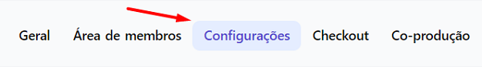
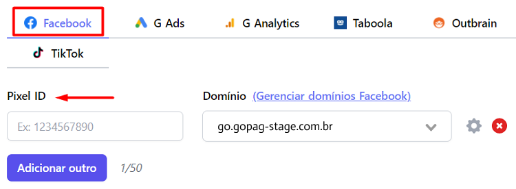
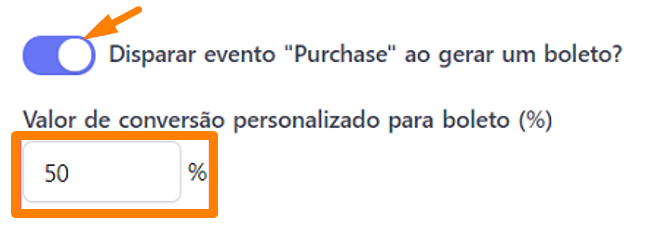
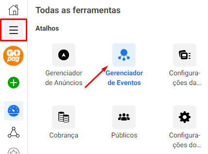
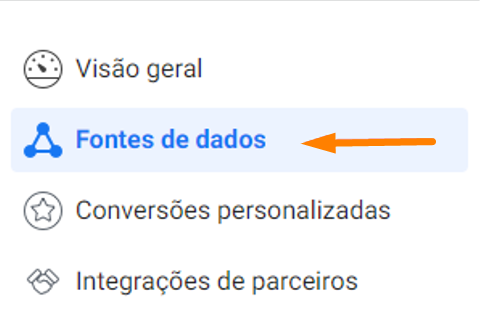
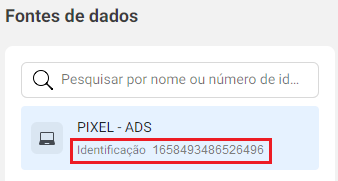
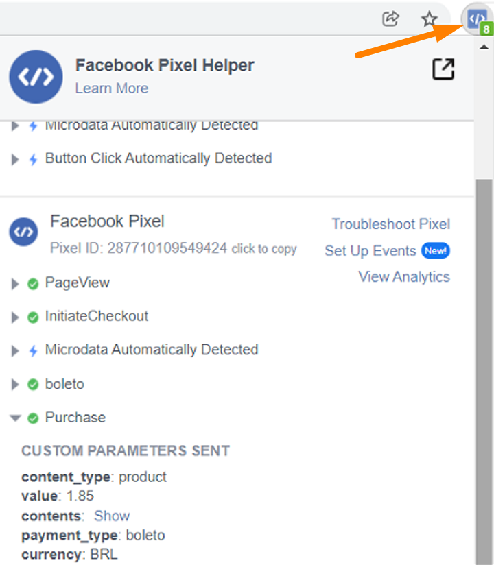

# 🔵 Pixel do Facebook

Você pode integrar o Pixel do Facebook aos seus produtos para rastrear as vendas e otimizar as campanhas de anúncio.

No menu principal, clique em Produtos e depois selecione o produto que deseja adicionar o pixel.

Em seguida, clique na aba Configurações:

Desça a tela até a opção de Pixels de conversão.

Preencha com o seu Pixel ID:


**Importante:** A nossa plataforma permite adicionar até 50 Pixels do Facebook em cada produto.


Para cada Pixel, você deve selecionar um domínio onde ele será disparado.

Por padrão, adicionamos o domínio da plataforma da GOPag, mas recomendamos que você coloque o domínio do seu website ou página de vendas, o mesmo que você verifica no Facebook.

## Perguntas frequentes

### Como funciona a verificação de domínio?

Os pixels são disparados no seu domínio, que você pode conectar à plataforma da GOPag. Esse deve ser o mesmo domínio verificado no Facebook.

Temos um tutorial explicando o passo a passo, [clique aqui](https://docs.gopag.com.br/ads_pixel/facebook_ads/conectar_dominio).

### Como adicionar uma porcentagem de conversão personalizada para pix ou boletos gerados?

É possível selecionar a porcentagem do valor do pix ou do boleto gerado para que ele tenha a conversão personalizada, gerando o evento de "purchase".

Essa ferramenta irá otimizar as suas campanhas, visto que auxilia a estimar uma porcentagem de conversão e qual valor de venda deve ser enviado ao Facebook.

Para ativar essa função, é necessário habilitar o evento Purchase ao gerar um pix ou boleto e adicionar a porcentagem desejada.

Veja o exemplo abaixo em que selecionamos a porcentagem de 50% do valor do boleto para enviar o evento de "purchase".

### Quais eventos a plataforma GOPag envia para o Pixel?

* InitiateCheckout (quando alguém visita o checkout)
* Purchase (compra aprovada no cartão ou PIX)
* Boleto (boleto gerado)

Em compras aprovadas no cartão, disparamos juntamente com o evento de "Purchase", o evento de "credit\_card".

Em compras aprovadas no pix, disparamos juntamente com o evento de "Purchase", o evento de "pix".

Por padrão, não disparamos o evento "purchase" para boleto gerado, mas você pode habilitar essa opção se preferir.


**Importante:** Compra recusada no cartão de crédito não gera evento de "purchase".


### Onde encontro meu Pixel do Facebook?

Acesse o Facebook Business Manager https://business.facebook.com e no menu à esquerda clique em Mais ferramentas, depois em Gerenciador de eventos.

Uma nova página abrirá, basta clicar no menu lateral esquerdo em Fontes de Dados:

E você encontrará o seu Pixel ID na coluna à esquerda:

### Como verificar se o meu Pixel do Facebook foi instalado corretamente?

O Facebook disponibiliza um Plugin para o Google Chrome que te ajuda a verificar o seu Pixel. Você pode fazer o download no link abaixo:

https://chrome.google.com/webstore/detail/facebook-pixel-helper/fdgfkebogiimcoedlicjlajpkdmockpc

Após instalado, acesse o link do seu checkout e selecione o ícone do FB Pixel Helper no canto superior direito do seu navegador para ver o Pixel encontrado.

Você pode ver na imagem acima alguns dos parâmetros que enviamos nos eventos, como a forma de pagamento, valor, ID do produto, entre outras informações.

### É possível usar a API de conversão do Facebook também?

Sim, nós temos um tutorial explicando [como configurar a API de conversão do Facebook](https://docs.gopag.com.br/ads_pixel/facebook_ads/config_api_facebook).

### Por que aparece outro Pixel ID que não é o meu no checkout?

Para a API de conversões do Facebook funcionar corretamente, nós temos que disparar um evento de PageView utilizando o Pixel da própria plataforma da GOPag. Isso é necessário para que os cookies do Facebook sejam identificados.

Por isso, você pode ver o nosso pixel sendo disparado como PageView no seu checkout, mas pode ignorar essa informação.
