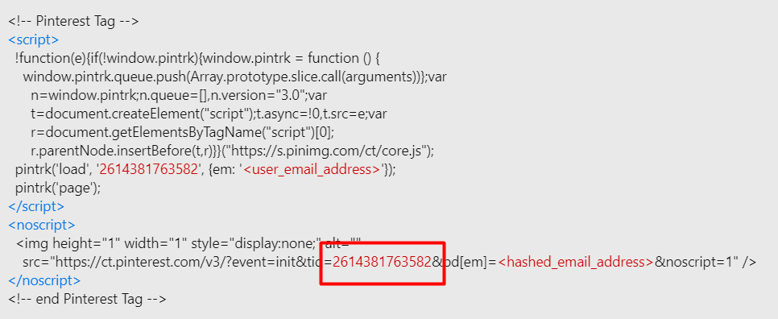
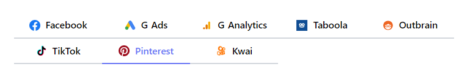
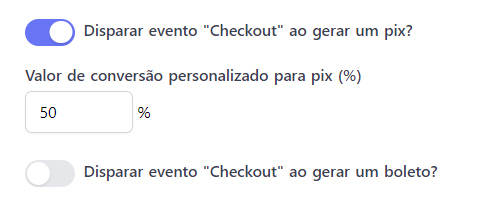

# 🔴 Pixel do Pinterest

### Como adicionar o Pixel do Pinterest ao seu produto

O pixel do Pinterest é uma excelente ferramenta para mensurar conversões e auxiliar na otimização dos anúncios.

### Onde encontro meu Pixel do Pinterest?

Acesse **Pinterest Ads Manager** [http://ads.pinterest.com](http://ads.pinterest.com) e clique em **Anúncios**, em seguida, clique em **Conversões**.

Após isso, será preciso clicar em **Gerenciador de Tags** e, depois, em **Instalar a Tag do Pinterest**.

Você deverá seguir com a **Configuração manual**, coletar o pixel ID e, então, instalar na plataforma da GOPag.


**Importante:** Lembrando que na imagem acima é apenas um exemplo, é necessário criar o seu próprio pixel ID na plataforma do **Pinterest Ads**.


### Colocando o Pixel ID do Pinterest na plataforma da GOPag

Na plataforma, acesse **Produtos -> Selecione o seu produto -> Configurações**, clique na opção do Pinterest e cole o pixel ID lá.

Após isso, você pode salvar o produto.

### Como adicionar uma porcentagem de conversão personalizada para pix e boletos gerados?

É possível selecionar a porcentagem do valor do pix ou boleto para que ele tenha a conversão personalizada, gerando o evento de **Checkout**.

Essa ferramenta irá otimizar as campanhas, visto que auxilia a estimar uma porcentagem de conversão e qual valor de venda deve ser enviado ao Pinterest Ads.

Veja o exemplo abaixo em que selecionamos a porcentagem de 50% do valor do pix para enviar o evento de Checkout.

Para ativar essa função, é necessário habilitar abaixo do Pixel ID.

### Quais eventos a plataforma da GOPag envia para o Pixel?

* **PageVisit** (Quando ocorre uma visita ao seu checkout)
* **AddToCart** (Início da finalização de compra)
* **Checkout** (Registro de compra aprovada)


**Importante:** Por padrão, não disparamos o evento "checkout" para boleto e pix gerado, mas você pode habilitar essa opção se preferir.


### Como verificar se o meu Pixel do Pinterest foi instalado corretamente?

O Pinterest disponibiliza um Plugin para o Google Chrome que auxilia na verificação do seu pixel, com ele é possível analisar em tempo real os disparos de eventos.

Para baixar, basta acessar o link a seguir:

[https://chrome.google.com/webstore/detail/pinterest-tag-helper](https://chrome.google.com/webstore/detail/pinterest-tag-helper/gmlcbajhgoaaegmlbaclmmmhpmfdajmp)

Após instalado, basta acessar o seu checkout e clicar no ícone do Pinterest Tag Helper para abrir a central de verificação da extensão e conseguir visualizar o seu pixel.

Na imagem acima é possível observar, também, alguns dos parâmetros que enviamos.

### É possível usar a API de conversão do Pinterest também?

A API de conversão do Pinterest ainda não está disponível.

\
 
