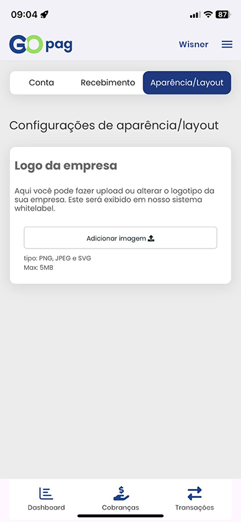

## Configurações de aparência/layout

Nesta tela, você pode personalizar a aparência do seu ambiente no GoPag.

No card **Logo da empresa**, é possível realizar o upload ou alterar o logotipo da sua empresa, que será exibido no sistema whitelabel.

Para adicionar uma imagem, clique em **Adicionar imagem** e selecione o arquivo desejado.

São aceitos os formatos:
- **PNG**
- **JPEG**
- **SVG**

O tamanho máximo permitido para o arquivo é de **5MB**.

Essa funcionalidade permite personalizar a identidade visual do sistema de acordo com a sua marca.

