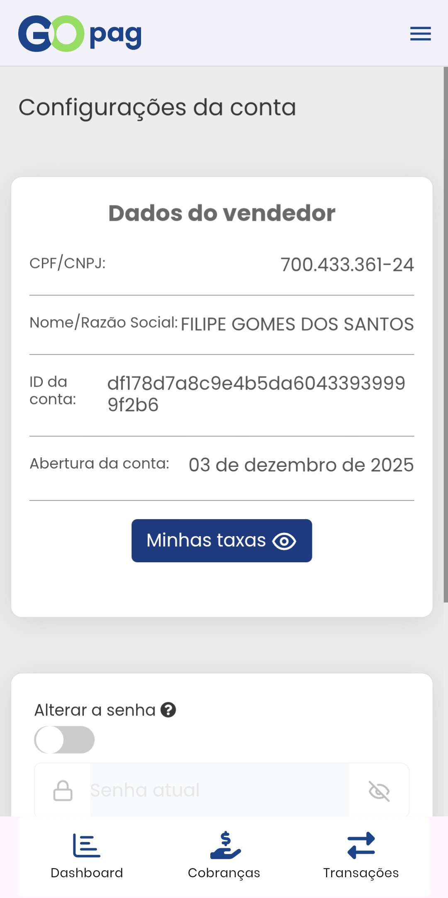
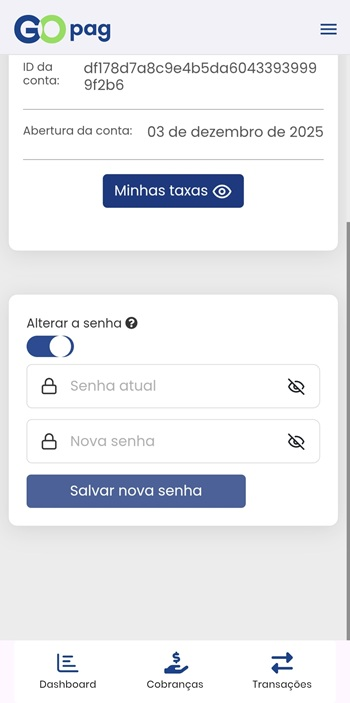

# ⚙️ Configurações

Nesta tela você encontra as principais opções de configuração da sua conta. O primeiro card exibe os dados fornecidos na contratação do serviço.

## Alterar senha de acesso

No segundo card está a opção **Alterar a senha**. Por segurança, o recurso só fica ativo quando o botão correspondente estiver habilitado. O procedimento é simples: informe a senha antiga e, em seguida, a nova senha.


**Importante:** a senha deve ter no mínimo 8 caracteres, incluindo letra minúscula (a–z), letra maiúscula (A–Z) e número (0–9).


