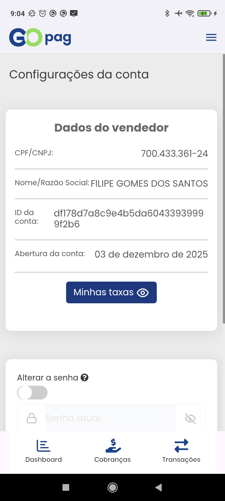

# ⚙️ Configurações

Aqui estão as configurações do usuário. O primeiro card é o único que mostra os dados que você nos forneceu no momento da contratação do nosso portal. 😊

## Alterar senha de acesso

No segundo card você vê a opção de `Alterar a senha`, observe que deixamos um botão de segurança que só permite que esse card funcione se ele estiver marcado, o procedimento é simples e rápido, precisando apenas digitar sua antiga senha e depois a nova para usá-la. Confira abaixo:


**Importante:** As senhas seguem algumas regras para serem aceitas, precisa ter no mínimo 8 caracteres, incluindo letra minúscula (a - z), letra maiúscula (A - Z) e número (0 - 9).


