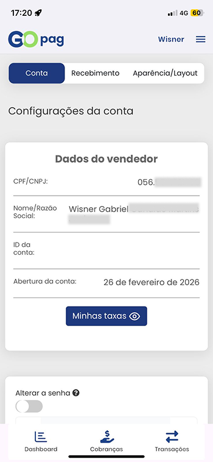
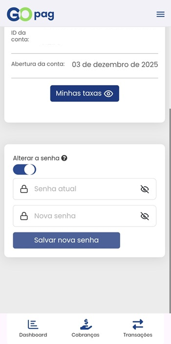

## 🔹 Configurações da Conta

Nesta tela, você pode visualizar e gerenciar as informações da sua conta no GoPag.

Na aba **Conta**, são exibidos os **dados do vendedor**, incluindo:
- **CPF/CNPJ**
- **Nome ou Razão Social**
- **ID da conta**
- **Data de abertura da conta**

Essas informações são apresentadas de forma clara para facilitar a conferência dos dados cadastrados.

Além disso, é possível acessar a opção **Minhas taxas**, onde você pode consultar as condições e tarifas aplicadas à sua conta.

Outras abas, como **Recebimento** e **Aparência/Layout**, permitem a configuração de preferências adicionais conforme a necessidade.

## Alterar senha de acesso

No segundo card está a opção **Alterar a senha**. Por segurança, o recurso só fica ativo quando o botão correspondente estiver habilitado. O procedimento é simples: informe a senha antiga e, em seguida, a nova senha.


**Importante:** a senha deve ter no mínimo 8 caracteres, incluindo letra minúscula (a–z), letra maiúscula (A–Z) e número (0–9).


