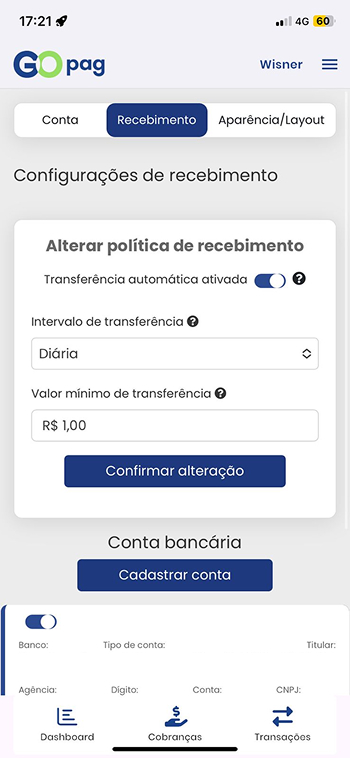
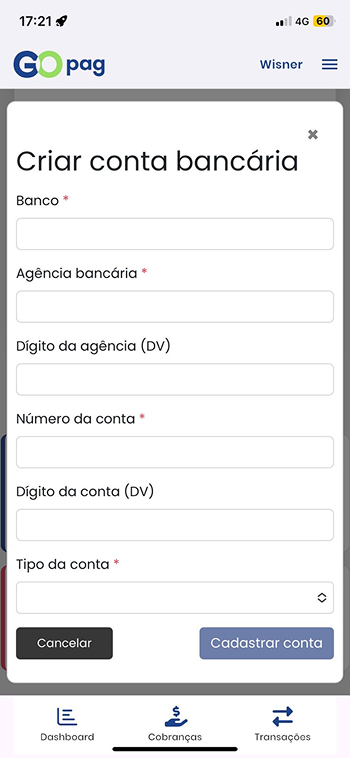

## Configurações de recebimento

Nesta tela, você pode configurar como deseja receber seus valores no GoPag.

No card **Alterar política de recebimento**, é possível definir:
- **Transferência automática ativada ou desativada**
- **Intervalo de transferência** (ex: diário)
- **Valor mínimo para transferência**

Essas opções permitem automatizar o envio dos valores para sua conta bancária de acordo com suas preferências.

Após realizar as alterações desejadas, basta clicar em **Confirmar alteração** para salvar as configurações.

## Conta bancária

Na parte inferior da tela, você encontra a seção de **Conta bancária**, onde é possível cadastrar uma conta para recebimento dos valores.

Para isso, clique em **Cadastrar conta** e preencha os dados solicitados.

## Cadastro de conta bancária

Nesta tela, você pode cadastrar uma conta bancária para receber os valores das suas transações no GoPag.

Para isso, é necessário preencher os dados solicitados, incluindo:
- **Banco**
- **Agência bancária**
- **Dígito da agência (DV)**
- **Número da conta**
- **Dígito da conta (DV)**
- **Tipo da conta**

Os campos marcados com (*) são obrigatórios para o cadastro.

Após preencher todas as informações corretamente, clique em **Cadastrar conta** para concluir o processo.

Caso deseje cancelar a operação, utilize o botão **Cancelar**.

