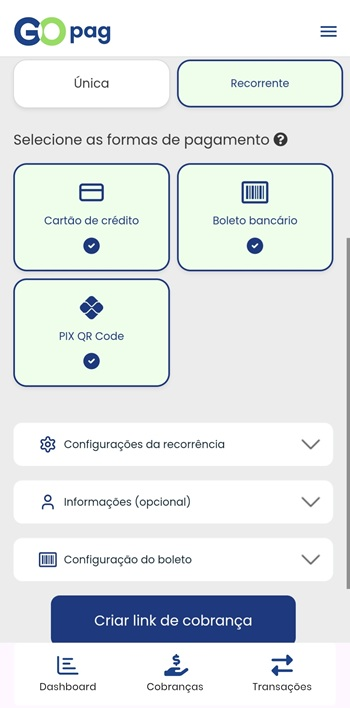
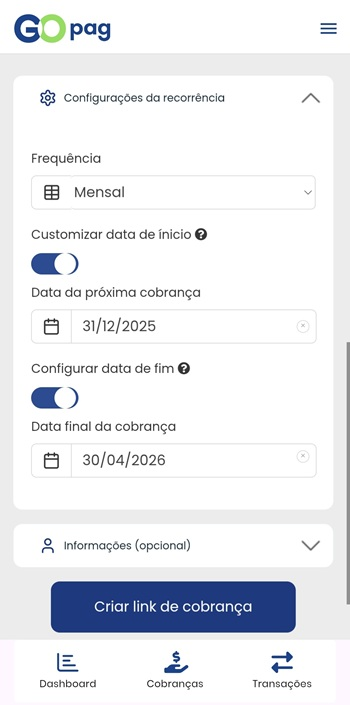

# 💰 Cobrança Recorrente

Ao escolher **Cobrança Recorrente**, você poderá configurar a frequência e o período das cobranças conforme sua necessidade.

A frequência disponível pode ser:

- **Diária**
- **Semanal**
- **Mensal**
- **Anual**

Também é possível definir o período da recorrência:

- **Data de início** — quando a primeira cobrança será gerada;
- **Data de término** — quando a última cobrança ocorrerá (opcional).

Você pode, opcionalmente, adicionar informações adicionais do pagador para personalizar a cobrança.

