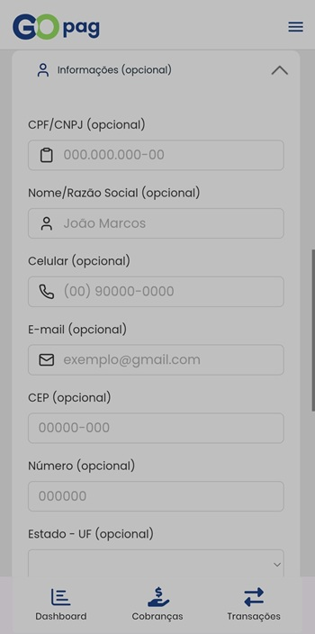

# 💰 Cobrança Recorrente

Ao escolher **Cobrança Recorrente**, será possível configurar a frequência e o período das cobranças conforme a necessidade.

A frequência disponível pode ser:

* **Diária**
* **Semanal**
* **Mensal**
* **Anual**

Também é possível definir o período da recorrência:

* **Data de início** — quando a primeira cobrança será gerada;
* **Data de término** — quando a última cobrança ocorrerá (opcional).

É possível, opcionalmente, adicionar informações adicionais do pagador para personalizar a cobrança.

