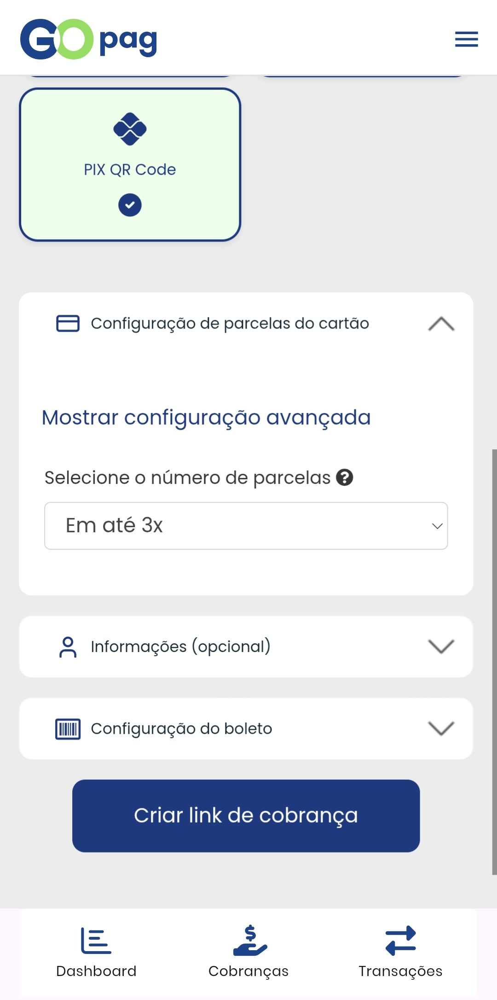
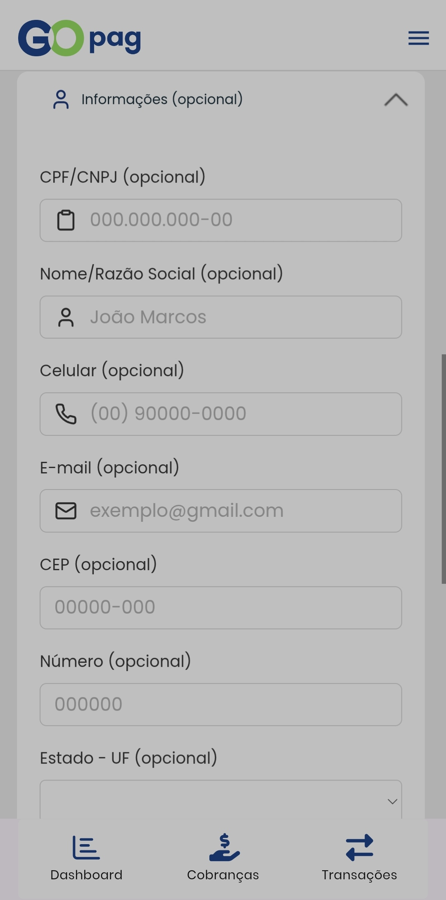
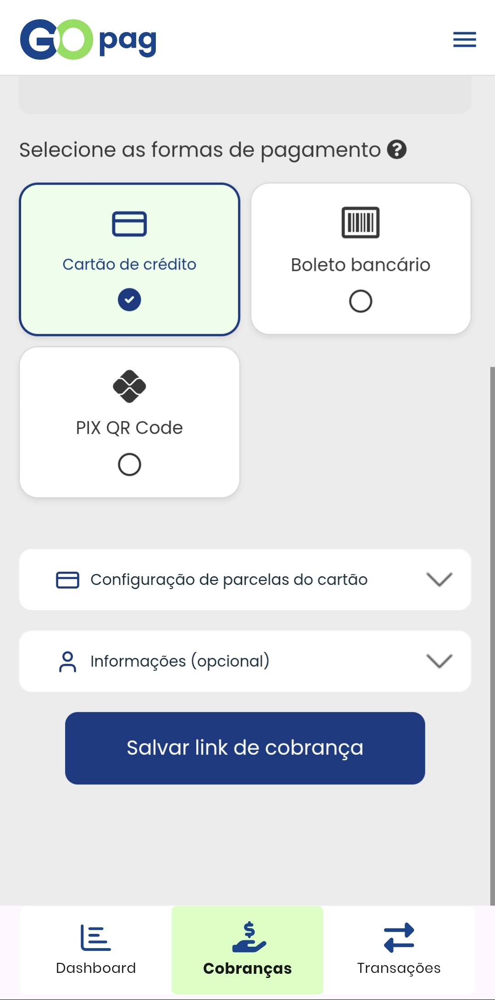
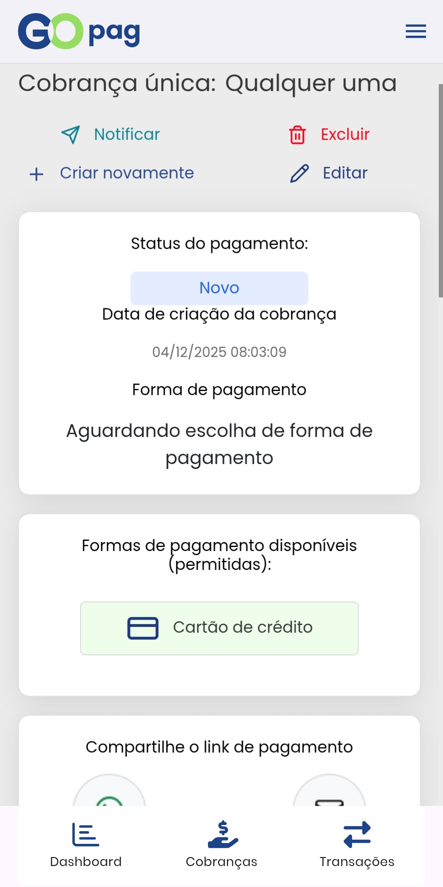
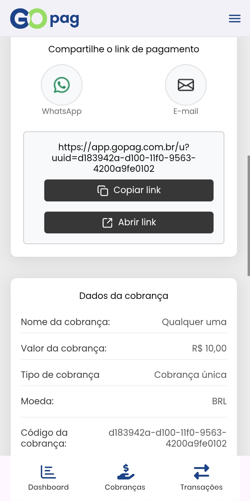
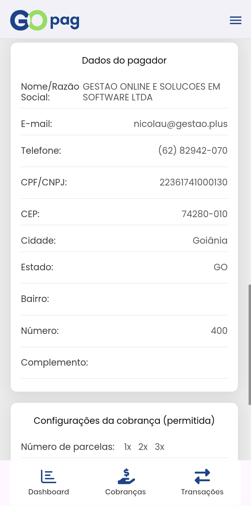
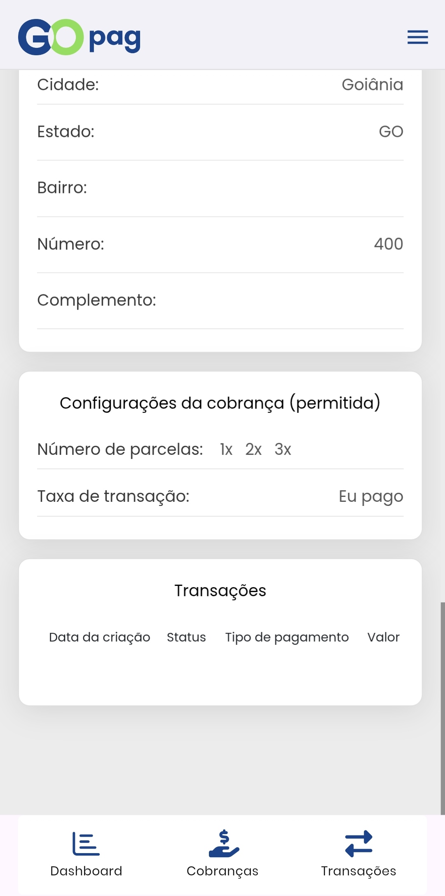

# 💰 Cobrança Única

Ao selecionar **Cobrança Única**, você poderá definir o número de parcelas (quando aplicável) e preencher os dados da cobrança.

Opcionalmente, adicione as informações pessoais do pagador (nome, e‑mail, telefone) para facilitar a identificação.

Após configurar os detalhes, toque em **Salvar link de cobrança** para gerar o link de pagamento.

Ao abrir o link da cobrança, a tela exibe as informações detalhadas da cobrança. Na primeira seção são apresentados o status do pagamento, a data e a forma de pagamento.

Na segunda seção você encontra o link de pagamento com opções para abrir, copiar para a área de transferência ou compartilhar por e‑mail e WhatsApp.

Na terceira seção são exibidos os dados do pagador informados no momento da criação do link.

Por fim, a tela mostra as configurações da cobrança e o histórico de transações relacionadas.

