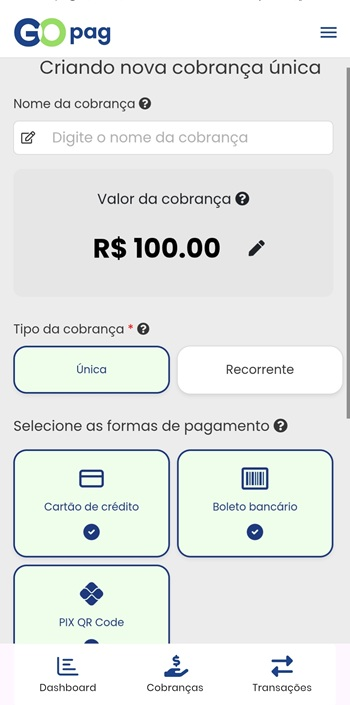

# ➕ Criar Cobrança

Para emitir uma cobrança no aplicativo, preencha os campos exibidos na tela de criação:

1. **Nome da cobrança:** descreva o motivo ou referência da cobrança.
2. **Valor:** informe o valor a ser cobrado.
3. **Tipo:** escolha entre **Única** ou **Recorrente**.
4. **Formas de pagamento:** selecione uma ou mais opções (Cartão, Pix, Boleto, etc.).

