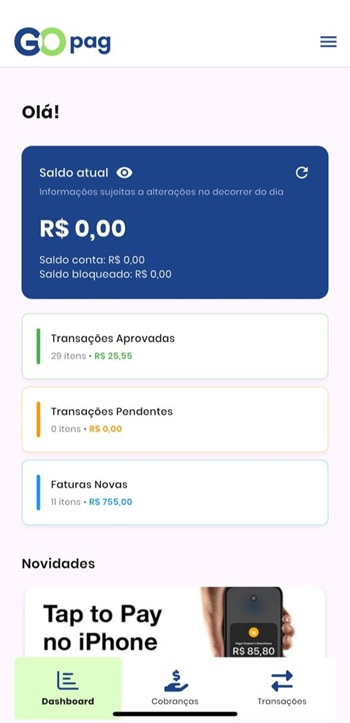
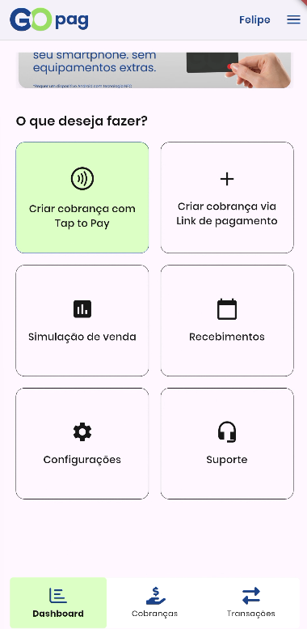

# 📊 Dashboard

## 🔹 Informações Principais

Na primeira seção da tela inicial você visualiza o saldo disponível de forma rápida e clara. Temos também atalhos para visualizar as **Transações Aprovadas**, **Transações Pendentes**, **Transações canceladas**, **Transações canceladas**, **Transações falhadas**.

## 🔹 Atalhos e serviços

A área de serviços reúne atalhos para as principais funcionalidades do aplicativo:

* **Tap to Pay** — cobrar com dispositivo compatível;
* **Criar cobrança** — emitir links ou cobranças avulsas;
* **Simular venda** — testar fluxo de vendas;
* **Recebimentos** — vêr o fluxo financeiro por data;
* **Configurações** — ajustar dados da conta;
* **Suporte** — abrir chamados e obter ajuda.

 
