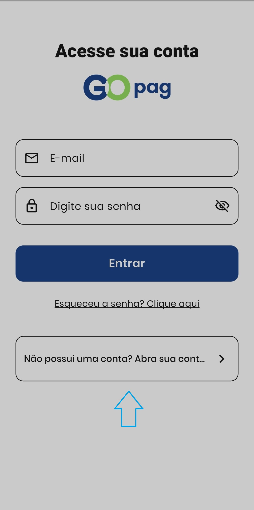
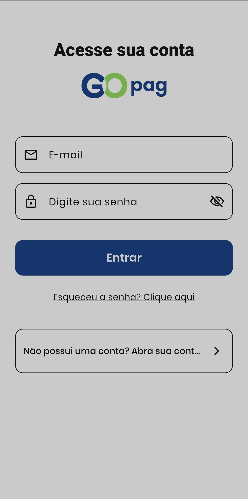

# 🔐 Apresentação

## 🔹 Registro no GoPag

Para criar sua conta no aplicativo GoPag, toque em **Cadastro** e preencha os dados solicitados. Após o envio, siga as instruções para ativação da conta.

## 🔹 Login no GoPag

Para acessar sua conta, informe o e‑mail e a senha cadastrados. Caso tenha esquecido a senha, utilize a opção **Esqueceu a senha? Clique aqui** para redefini‑la.

