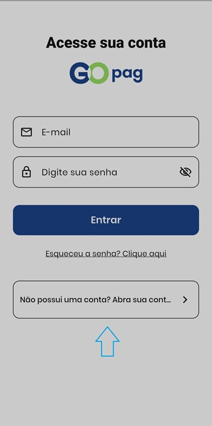
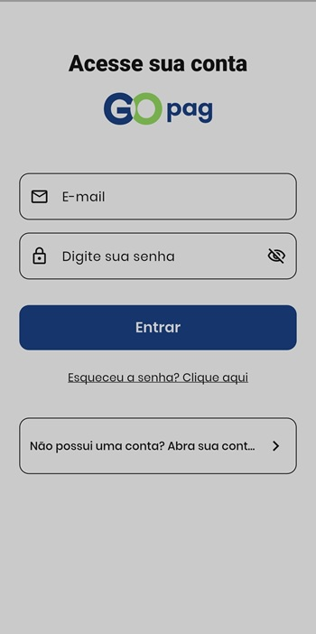
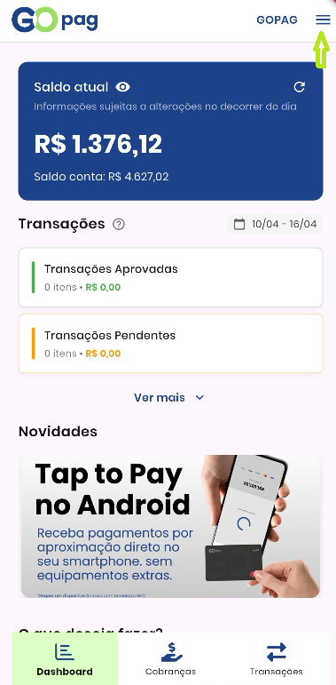
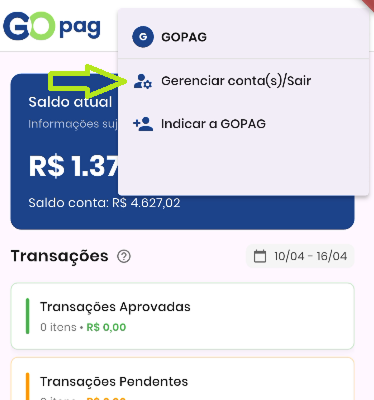
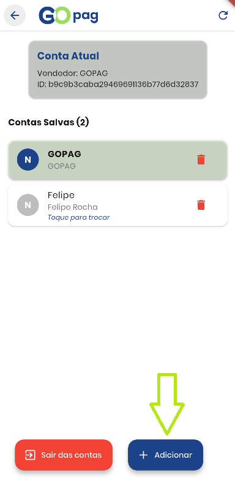
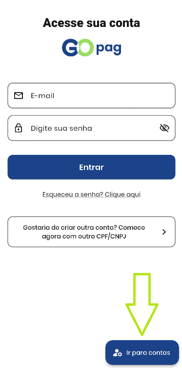

# 🔐 Login / Cadastro

## 🔹 Registro no GoPag

Para criar sua conta no aplicativo GoPag, toque em **Cadastro** e preencha os dados solicitados. Após o envio, siga as instruções para ativação da conta.

## 🔹 Login no GoPag

Para acessar sua conta, informe o e‑mail e a senha cadastrados. Caso tenha esquecido a senha, utilize a opção **Esqueceu a senha? Clique aqui** para redefini‑la.

## 🔹 Trocar de Conta no GoPag

Caso deseje acessar outra conta no aplicativo, você pode realizar a troca de forma simples e rápida.
Para isso, toque nos três pontinhos no canto superior direito da tela e selecione a opção Gerenciar usuários.

Em seguida, você poderá adicionar um novo usuário ou remover uma conta existente, conforme necessário.

Após clicar em adicionar novo usuário, você será direcionado para a tela de login, onde deverá inserir os dados da conta desejada.

Na própria tela de login, também é possível gerenciar e selecionar a conta que deseja acessar.

