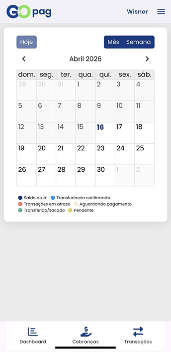

## 🔹 Recebimentos

Nesta tela, você pode visualizar suas transações organizadas por data, facilitando o acompanhamento das movimentações ao longo do tempo.  
É possível alternar entre as visualizações de mês e semana, além de utilizar a opção Hoje para retornar rapidamente à data atual.  
Ao selecionar um dia específico, você poderá identificar o status das transações por meio das cores indicadas na legenda abaixo.

As cores representam:

* **Saldos atual** 

* **Transferência confirmada**  

* **Transações em atraso**  

* **Aguardando pagamento**  

* **Transferido/sacado**  

* **Pendente**  

Essa visualização permite um controle mais claro e organizado das suas movimentações financeiras.

