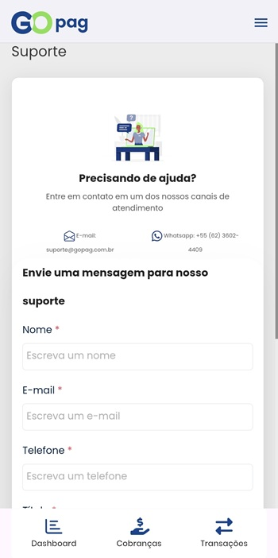

# 🆘 Suporte

Se encontrar algum problema ou comportamento inesperado no aplicativo, entre em contato com nossa equipe de suporte para que possamos ajudar o mais rápido possível.

Ao abrir um chamado, descreva o problema com detalhes (passos executados, telas afetadas e, se possível, prints). Essas informações agilizam a investigação e a solução.

Também é possível enviar um e‑mail para: [suporte@gopag.com.br](mailto:suporte@gopag.com.br). Sempre inclua uma descrição clara do problema e, quando aplicável, os prints que ilustram a situação.

