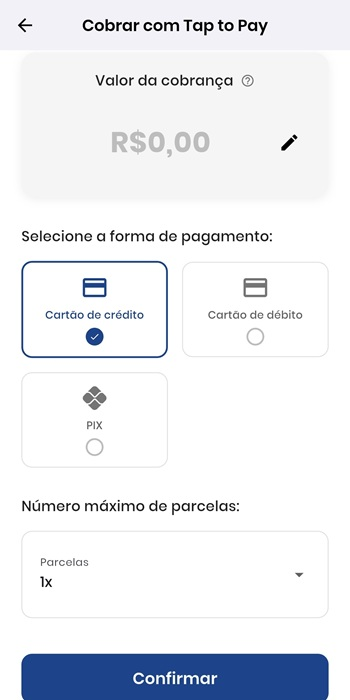

# 📲 Cobrar com Tap to Pay

## 🔹 Cartão de Crédito

Para cobrar com cartão de crédito:

1. Informe o valor da cobrança.
2. Selecione **Cartão de Crédito** como forma de pagamento.
3. Opcionalmente, selecione o número de parcelas.
4. Toque em **Confirmar** para abrir a tela do Tap to Pay e concluir a transação.

## 🔹 Cartão de débito e Pix

Para cobrar com cartão de débito ou Pix, selecione a forma desejada e toque em **Confirmar** para acessar a tela do Tap to Pay.

