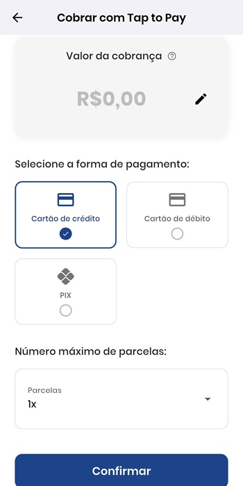
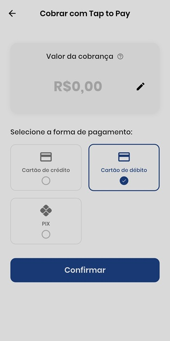
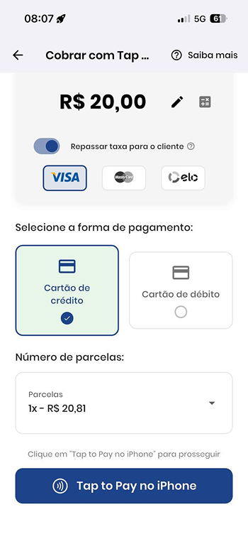
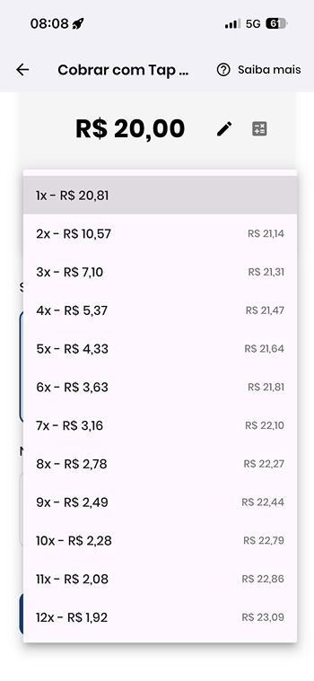

# 💳 Tap to Pay

## 🔹 Cartão de Crédito

Para cobrar com cartão de crédito:

1. Informe o valor da cobrança.
2. Selecione **Cartão de Crédito** como forma de pagamento.
3. Opcionalmente, selecione o número de parcelas.
4. Toque em **Confirmar** para abrir a tela do Tap to Pay e concluir a transação.

## 🔹 Cartão de débito e Pix

Para cobrar com cartão de débito ou Pix, selecione a forma desejada e toque em **Confirmar** para acessar a tela do Tap to Pay.

## 💰 Repassar taxa para o cliente

Na tela de cobrança com cartão de crédito, existe a opção **“Repassar taxa para o cliente”**.

Ao ativar essa opção:

- O valor das taxas da transação é **incluído no valor final pago pelo cliente**.
- O valor exibido nas parcelas é atualizado automaticamente, mostrando:
  - **Valor da parcela**
  - **Valor total da compra com taxas incluídas**

  

### 📌 Como funciona na prática

- **Desativado:**  
  A taxa é descontada do valor da venda.  
  Exemplo: em uma cobrança de R$ 20,00, você recebe menos devido às taxas.

- **Ativado:**  
  O sistema recalcula o valor para que o cliente pague as taxas.  
  Exemplo:
  - 1x de R$ 20,81  
  - 2x de R$ 10,57  
  - etc.

   

Nesse caso, você recebe o valor integral (R$ 20,00), e a taxa é repassada ao cliente.

### ⚠️ Importante

- O repasse de taxa se aplica apenas para **cartão de crédito**.
- Para **débito e Pix**, não há parcelamento nem repasse configurável nessa tela.
- Os valores exibidos já incluem as taxas — não é necessário cálculo manual.
