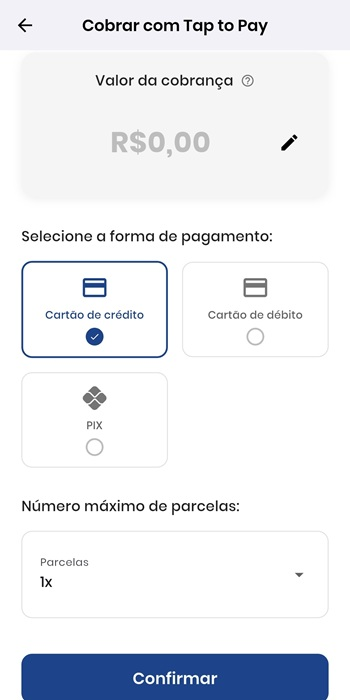
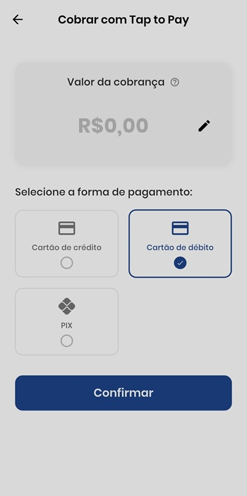
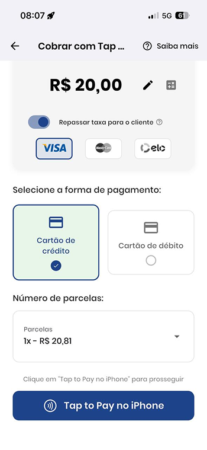
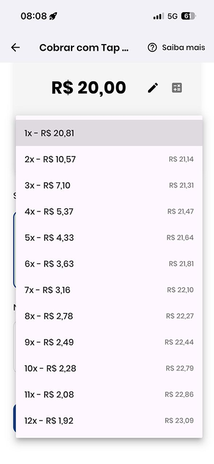
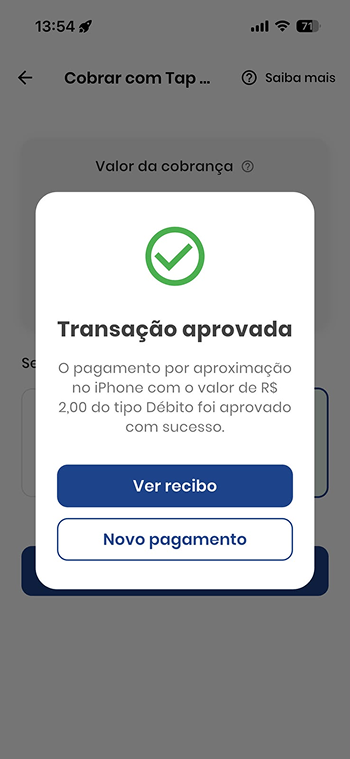
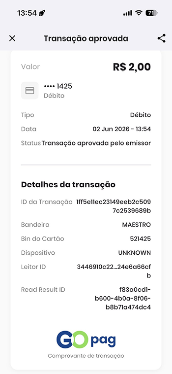
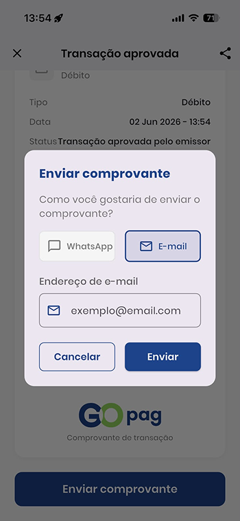
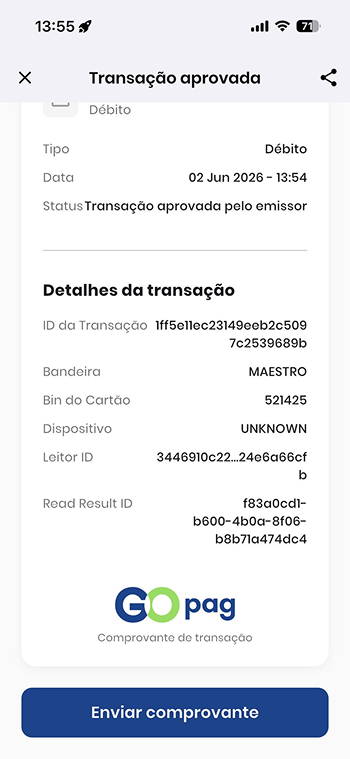
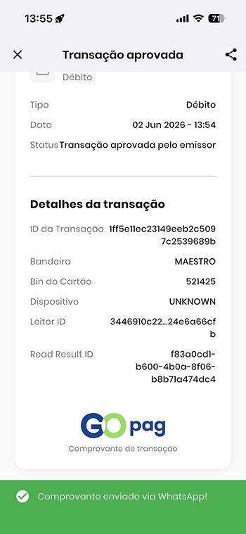

# 💳 Tap to Pay

## 🔹 Cartão de Crédito

Para cobrar com cartão de crédito:

1. Informe o valor da cobrança.
2. Selecione **Cartão de Crédito** como forma de pagamento.
3. Opcionalmente, selecione o número de parcelas.
4. Toque em **Confirmar** para abrir a tela do Tap to Pay e concluir a transação.

## 🔹 Cartão de débito e Pix

Para cobrar com cartão de débito ou Pix, selecione a forma desejada e toque em **Confirmar** para acessar a tela do Tap to Pay.

## 💰 Repassar taxa para o cliente

Na tela de cobrança com cartão de crédito, existe a opção **“Repassar taxa para o cliente”**.

Ao ativar essa opção:

- O valor das taxas da transação é **incluído no valor final pago pelo cliente**.
- O valor exibido nas parcelas é atualizado automaticamente, mostrando:
  - **Valor da parcela**
  - **Valor total da compra com taxas incluídas**

  

### 📌 Como funciona na prática

- **Desativado:**  
  A taxa é descontada do valor da venda.  
  Exemplo: em uma cobrança de R$ 20,00, você recebe menos devido às taxas.

- **Ativado:**  
  O sistema recalcula o valor para que o cliente pague as taxas.  
  Exemplo:
  - 1x de R$ 20,81  
  - 2x de R$ 10,57  
  - etc.

   

Nesse caso, você recebe o valor integral (R$ 20,00), e a taxa é repassada ao cliente.


**Detalhe:** As taxas apresentadas nesta documentação são meramente ilustrativas. As condições reais podem variar de acordo com o perfil do negócio e outros fatores específicos.

Para consultar as taxas atualizadas e aplicáveis ao seu caso, acesse o aplicativo.

Ressaltamos que as taxas podem ser alteradas a qualquer momento, sem aviso prévio.


## ✅ Transação aprovada

Após a aproximação do cartão e a autorização do emissor, a transação será concluída com sucesso.

A tela de confirmação exibe:

- Valor da transação
- Forma de pagamento
- Data e hora
- Status da operação

O usuário pode escolher entre:

- **Ver recibo**: visualizar os detalhes completos da transação.
- **Novo pagamento**: iniciar uma nova cobrança.

---

## 🧾 Visualizar recibo

Ao tocar em **Ver recibo**, serão exibidos os detalhes completos da transação, incluindo:

- Valor pago
- Final do cartão
- Tipo da transação
- Data e hora
- ID da transação
- Bandeira do cartão
- Informações técnicas da leitura

---

## 📤 Enviar comprovante

Para compartilhar o comprovante com o cliente, toque em **Enviar comprovante**.

---

## 📧 Selecionar forma de envio

Ao tocar em **Enviar comprovante**, será exibida uma janela para seleção da forma de compartilhamento.

As opções disponíveis são:

- **WhatsApp**
- **E-mail**

Ao selecionar **E-mail**, informe o endereço desejado e toque em **Enviar** para compartilhar o comprovante.

Também é possível cancelar a operação utilizando o botão **Cancelar**.

---

## ✅ Comprovante enviado

Após o envio do comprovante, o aplicativo exibirá uma mensagem de confirmação na parte inferior da tela informando que o compartilhamento foi realizado com sucesso.

