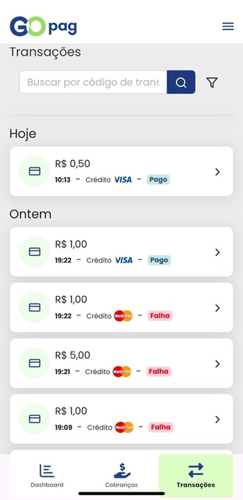
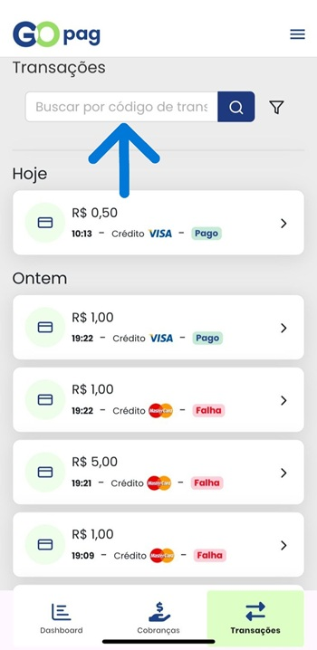

# 🔄️ Transações

Com a plataforma da GOPag sendo omnichannel, neste menu estão organizadas todas as transações realizadas, por máquinas MPOS(Mobile Point os Sale), POS(Point of Sale), PIN Pad, TEF, Tap to pay (Celular com Android ou IOS vira maquininha) e até mesmo E-commerces parceiros.

Aqui é possível utilizar os filtros para busca, ou a barra de pesquisa, confira melhor nas explicações abaixo:

Para ficar mais fácil a busca por uma transação específica, é possível usar a barra de pesquisa que está marcada na imagem abaixo:


**Importante:** A barra de pesquisa faz uma busca somente pelo **`Código de transação`** da cobrança. 😉


