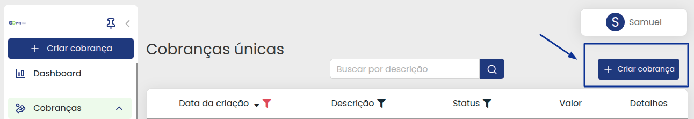
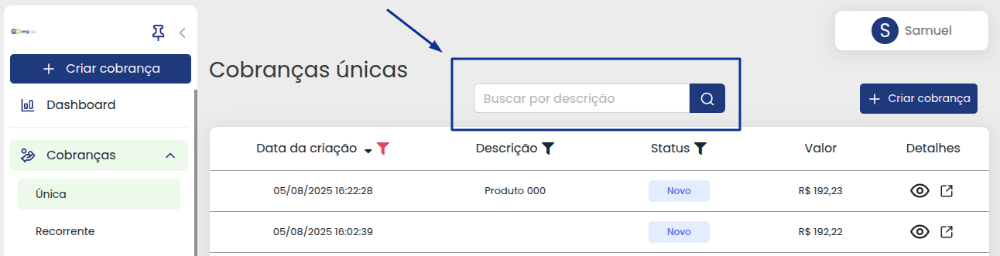
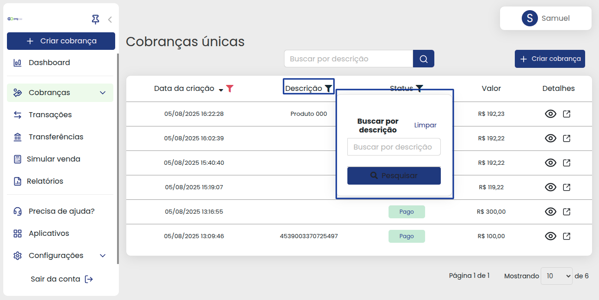
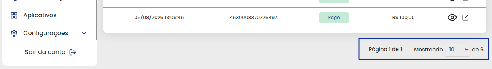
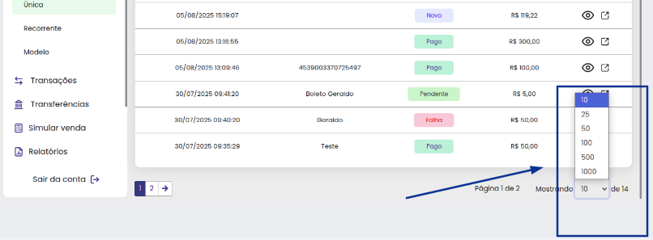

# 📍 Cobranças Modelo

Este é o nosso menu de cobranças modelo, todos os links gerados ficam registrados aqui e você pode acompanhar melhor as movimentações, vamos conhecer agora cada parte dele 😁:

Colocamos já no início um atalho para que você possa criar uma nova cobrança enquanto estiver vendo os links de cobrança gerados, clicando aqui nesta opção:


**Importante:** Caso queira mais informações sobre criar cobrança [clique aqui ](https://docs.gopag.com.br/criar_cobranca)para acessar a explicação completa dessa função.


Para ficar mais fácil a busca específica por uma cobrança, você pode usar a nossa **`barra de pesquisa`** que está marcada na imagem abaixo:


**Importante:** A barra de pesquisa faz uma busca somente pelo texto que foi colocado na descrição da cobrança modelo, para outro tipo de busca, confira abaixo as opções disponíveis 😉


 

Em cada item das cobranças modelo colocamos filtros para facilitar a pesquisa por algo mais específico, por exemplo, a opção na **`data de criação`**, escolhendo data de início e término da busca, ou você pode usar um dos nossos atalhos de período que aparecem assim que se abre o calendário, abaixo uma breve demonstração de uso:

 

Também é possível usar o filtro de busca por **`Descrição`**, ele tem a mesma função que nossa barra de pesquisa, e você pode usar o que for mais prático para o momento:

 

Já o filtro de **`status`**, traz todas as opções de status disponíveis, lembrando que os filtros também podem ser utilizados em conjunto para uma busca específica:

* Sendo utilizado
* Cancelado
* Pendente
* Novo

Confira no exemplo abaixo:

Em cada cobrança modelo gerada, você pode observar que na opção detalhes, existem dois ícones:

*  O ícone do olhinho abrirá o link de cobrança para você conferir detalhes sobre ela.
*  E o ícone do quadrado com a setinha, tem quase a mesma função, porém abrirá para você em uma nova janela.

Passando assim, mais de uma possibilidade para acessar as informações 😉👍


**Detalhe:** Caso queira mais informações sobre detalhes de cobrança modelo [clique aqui ](https://docs.gopag.com.br/criar_cobranca/link_cobranca/link_cobranca_modelo)para acessar a explicação sobre cada parte desta função.


 

A paginação na parte final, onde você pode aumentar a quantidade visível de cobranças mostradas para até 1000 itens na página:

.

