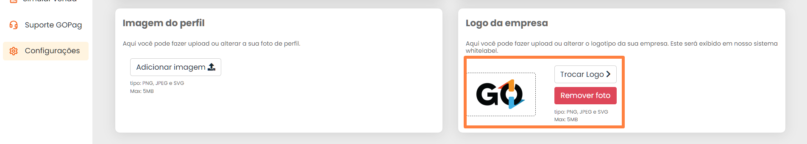

# Menu Configurações

Aqui você encontra as configurações do usuário, nestes quatro cards que veremos o primeiro deles é o único que já mostra os dados que você nos passou no ato da contratação do nosso Portal 😊

 

Agora no segundo card temos a opção de Alterar a senha, observe que deixamos um botão de segurança que só deixa esse card funcionar se ele estiver marcado, o procedimento é simples e rápida, precisando apenas digitar sua antiga senha e depois a nova para poder validarmos e você usá-la, confira abaixo:


**Importante:** As senhas seguem algumas regras para serem aceitas, precisa ter no mínimo 8 caracteres, dentre eles Letra Minúscula (a - z), Letra Maiúscula (A - Z) e número (0 - 9).


Logo mais abaixo temos a opção de alterar a Imagem do Perfil, a gente tem apenas alguns requisitos para quer tudo funcione direitinho no nosso portal, essa imagem precisa ter um dos seguintes formatos, PNG, JPEG ou SVG. O tamanho também tem um limite que é de apenas 5MB, confira abaixo o passo a passo para substuição da sua foto de perfil:

 

O mesmo também vai se aplicar a logo da sua empresa, você pode onfigurá-la igual o exemplo abaixo, deixando a identidade visual da sua empresa agregada ao nosso portal 😉 

A


**Detalhe:** As regras de imagem são as mesmas para a foto de perfil descritos acima. Ou seja a imagem precisa ter um dos seguintes formatos, PNG, JPEG ou SVG. O tamanho também tem um limite que é de apenas 5MB!


