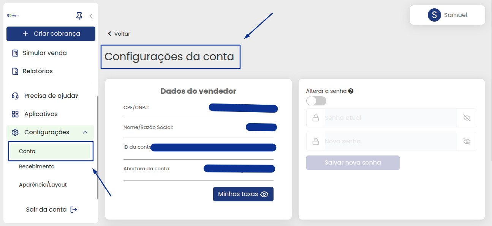
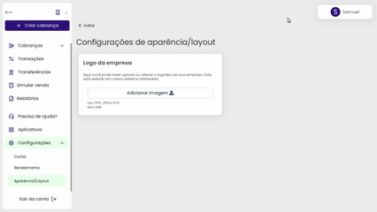
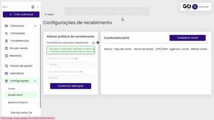
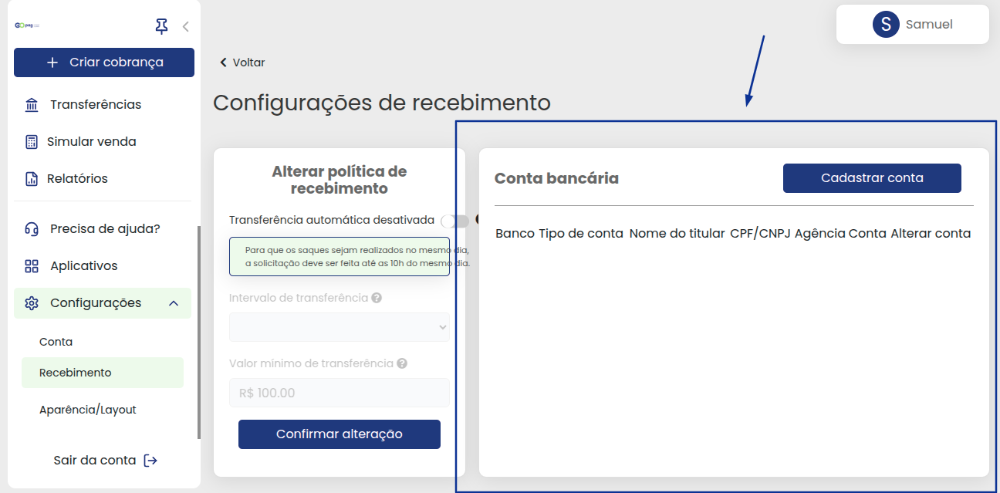
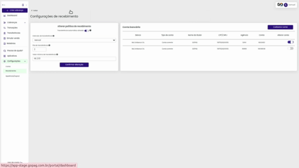
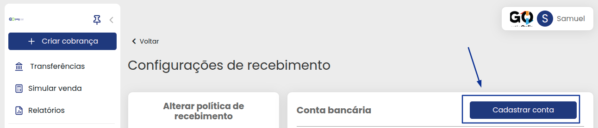

# Menu configurações

Aqui você encontra as configurações do usuário, nestes cards que veremos o primeiro deles é o único que já mostra os dados que você nos passou no ato da contratação do nosso portal 😊

 

### Alterar senha de acesso

Agora no segundo card você vê a opção de `Alterar a senha`, observe que deixamos um botão de segurança que só deixa esse card funcionar se ele estiver marcado, o procedimento é simples e rápido, precisando apenas digitar sua antiga senha e depois a nova para você usá-la, confira abaixo:


**Importante:** As senhas seguem algumas regras para serem aceitas, precisa ter no mínimo 8 caracteres, dentre eles Letra Minúscula (a - z), Letra Maiúscula (A - Z) e Número (0 - 9).


 

### Alterar imagem de perfil

Mais abaixo, tem a opção de alterar a `Imagem do perfil`, nós pedimos apenas alguns requisitos, para que tudo funcione direitinho no nosso portal, essa imagem precisa ter um dos seguintes formatos, PNG, JPEG ou SVG. 

O tamanho também tem um limite, que é de apenas 5MB, confira abaixo o passo a passo para substituição da sua foto de perfil:

 

### Alterar logo da empresa

O mesmo também se aplica a `Logo da empresa`, você pode configurá-la igual o exemplo abaixo, deixando a identidade visual da sua empresa agregada ao nosso portal, aparecendo nos boletos, links de cobrança e mensagens de aviso! 😉


**Detalhe:** As regras de imagem da logo da empresa são as mesmas para a foto de perfil descritos acima. Ou seja, a imagem precisa ter um dos seguintes formatos, PNG, JPEG ou SVG. O tamanho também tem um limite que é de apenas 5MB!


 

### Configurações de recebimento

Uma configuração importante presente na plataforma da **GOPag** é a opção de `Alterar politica de recebimento` você pode deixar automática ou manual as transferências de valores.

Quando esta opção está ativada, você precisa definir o intervalo de transferência entre diário, semanal ou mensal (No modo mensal você pode definir o dia que ocorrerá a transferência, caso queira).

No último campo você define qual a menor quantia em dinheiro que pode ser transferida. Veja o exemplo abaixo:

 

## Conta bancária

Fechando a opções do menu de configurações, temos a `Conta bancária`, você pode cadastrar mais de uma conta, e definir para onde irá as transferências.

Caso você queira a troca de conta por uma outra já cadastrada, um aviso será mostrado a você para confirmar a alteração, observe abaixo:

Mas não fica só por aí, caso queira adicionar uma nova conta bancária, basta clicar no botão `Cadastrar conta` do lado esquerdo da tela:

Ao clicar neste botão, uma janela pop-up será mostrada a você para poder inserir os dados da conta, com o tipo, código do banco, agência bancária, digito do banco e número da conta. Confira o exemplo abaixo:


**Atenção:** No campo `Código do banco` caso digite errado a conta bancária não será cadastrada, por isso confirme a informação antes de clicar em cadastrar conta.



**Importante:** Ao adicionar uma conta bancária a plataforma, não é possivel remover depois, por isso confira corretamente quando for fazer o cadastro.
