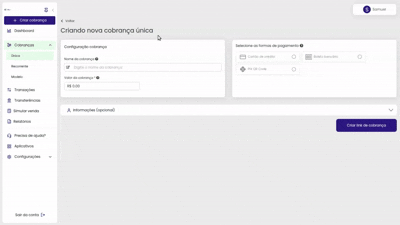

# 🖋️ Informações do cliente

Na parte de informações do cliente, já é possível preencher no momento de gerar a cobrança, observe que ao final há um botão para ativar o envio de notificações e atualizações desta cobrança por e-mail ou SMS do pagador. Mas ele só ficará disponível caso seja preenchido o campo de e-mail.

Observe o exemplo que fizemos abaixo:

Agora se você tiver criado uma cobrança modelo, irá aparecer somente o botão de envio de notificações, não sendo necessário preencher nenhuma informação do cliente, pois ficará disponível para que ele preencha no ato do pagamento:

 

Ok, mas e quanto ao restante das informações no caso da cobrança avulsa?

O cliente pode completar as demais informações no momento em que for efetuar o pagamento! 😉👍

confira abaixo a visão do cliente no momento do pagamento:

