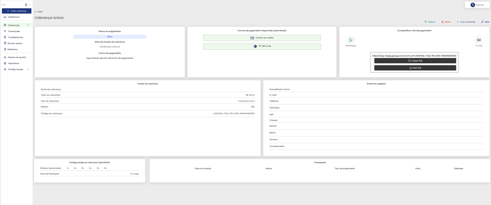

# 🔗 Gerar Link de Cobrança

Após você clicar para gerar o link de cobrança, teremos esta tela abaixo, aqui estão todas as informações necessárias para que você possa acompanhar o processo do pagamento/recebimento:

Qual o tipo de cobrança você está gerando? Clique abaixo na de sua preferência e veja mais informações sobre ela:

<table data-view="cards"><thead><tr><th></th><th></th><th></th><th data-hidden data-card-target data-type="content-ref"></th><th data-hidden data-card-cover data-type="files"></th></tr></thead><tbody><tr><td><strong>Gerar link cobrança avulsa</strong></td><td></td><td></td><td><a href="LINK_COBRANCA_AVULSA/">LINK_COBRANCA_AVULSA</a></td><td><a href="../../.gitbook/assets/icon_cobranca_avulsa.png">icon_cobranca_avulsa.png</a></td></tr><tr><td><strong>Gerar link cobrança modelo</strong></td><td></td><td></td><td><a href="LINK_COBRANCA_MODELO/">LINK_COBRANCA_MODELO</a></td><td><a href="../../.gitbook/assets/icon_cobranca_modelo.png">icon_cobranca_modelo.png</a></td></tr></tbody></table>
