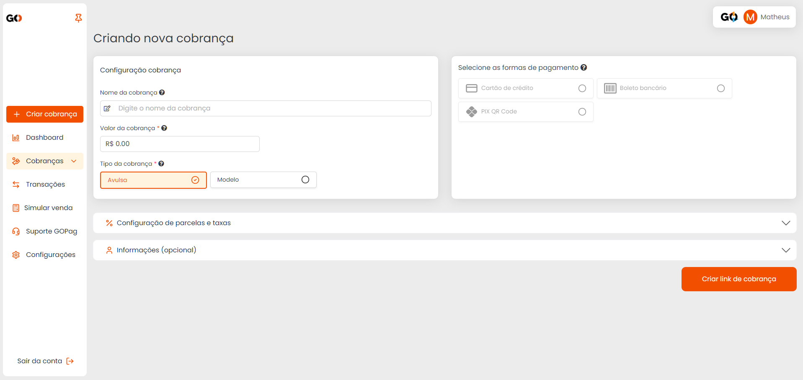
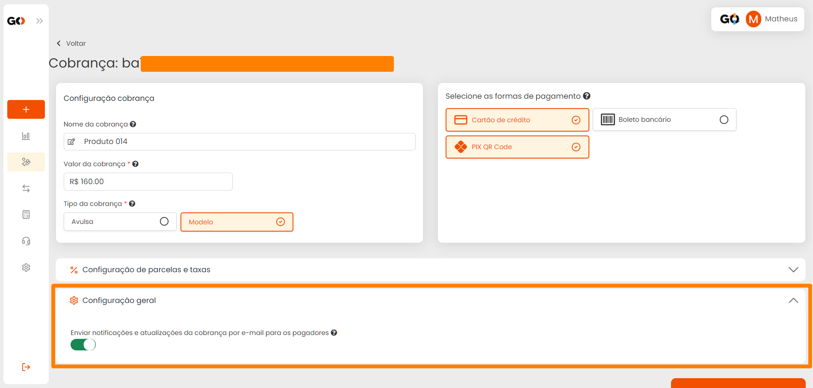

# ➕ Criar Cobrança

**Configuração da Cobrança**

De início você tem a Configuração da cobrança, onde pode identificar o tipo de cobrança que será gerada, o valor e até definir se ela sera Avulsa ou um modelo a ser utilizado outras vezes.

**Informações do Cliente**

Na parte de informações do cliente você pode preencher no momento de gerar a cobrança, ou deixar para que o cliente preencha no momento que for efetuar o pagamento, tornando assim mais ágil as emissões:

