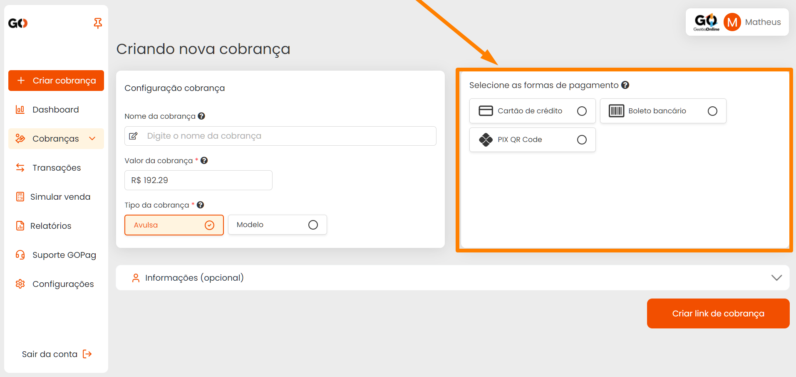

# ➕ Criar Cobrança

**Configuração da Cobrança**

De início você tem a Configuração da cobrança, onde pode identificar o tipo de cobrança que será gerada, o valor e até definir se ela sera Avulsa ou um modelo a ser utilizado outras vezes.

**Formas de Pagamento**
 
Após preencher os dados iniciais da cobrança, você precisa escolher as formas de pagamento para o cliente (Caso você não defina, por padrão nós deixaremos disponíveis ao cliente as opções Cartão de Crédito e Pix)

**Cartão de Crédito**

Neste momento você precisará definir a quantidade de parcelas (Caso seja Cartão de credito), Marcar se as taxas da cobrança será repassadas ao cliente ou não. Caso seja repassada, defina o valor no último campo, assim como o exemplo abaixo:

**Pix**

Para a opção de pagamento via Pix o parcelamento fica desabilitado, mas será possivel adicionar a Taxa de Transação para o cliente pagar, caso queira: 

**Configuração de Parcelas e Taxas**

 
 

