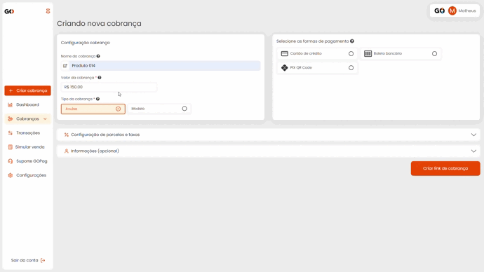

De início você tem a Configuração da cobrança, onde pode identificar o tipo de cobrança que será gerada, valor, e escolher um dos tipos disponíveis, sendo eles:

## [- **Avulsa**](https://docs.gopag.com.br/criar_cobranca/link_cobranca)

Quando falamos de cobrança do tipo Avulsa nos referimos a um pagamento único ou pontual que é feito por um produto ou serviço específico, sem a necessidade de um compromisso contínuo. Como exemplo a compra de um item em uma loja online e pagar por ele uma única vez.

## [- **Modelo**](https://docs.gopag.com.br/criar_cobranca/link_cobranca/link_cobranca_modelo)

A cobrança modelo ao ser gerada, cria um link único que pode ser utilizado diversas vezes para pagamento de um valor fixo, e para cada transação nesse único link você terá um relatório completo de quem efetuou o pagamento, tudo isso e muito mais na nossa  plataforma da GOPag.

<!-- # [- **Recorrente**](https://docs.gopag.com.br/criar_cobranca/link_cobranca/link_cobranca_recorrente)

O pagamento recorrente é um método de cobrança periódica, feita com recorrência mensal, quinzenal ou anual enquanto o contrato de serviço durar. Entre os serviços que utilizam o sistema de pagamento recorrente, podemos falar de Cursos, Contabilidade, Mensalidade escolar, Honorários, Editoras e Empresas de Telecomunicações.
 -->

