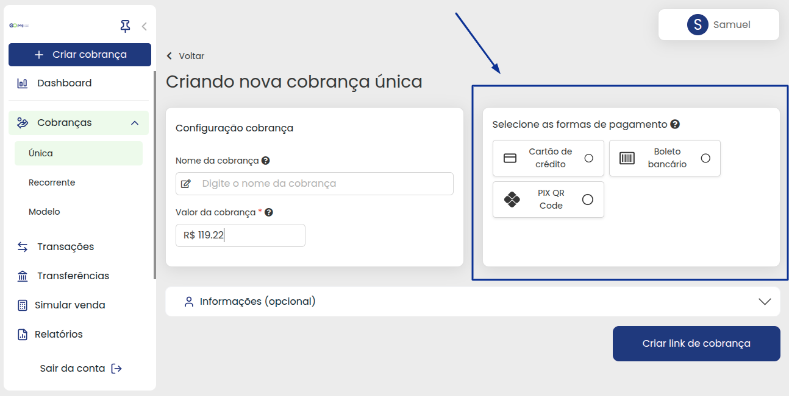
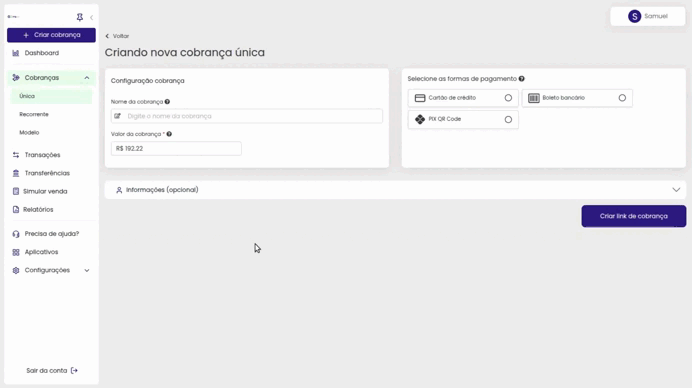
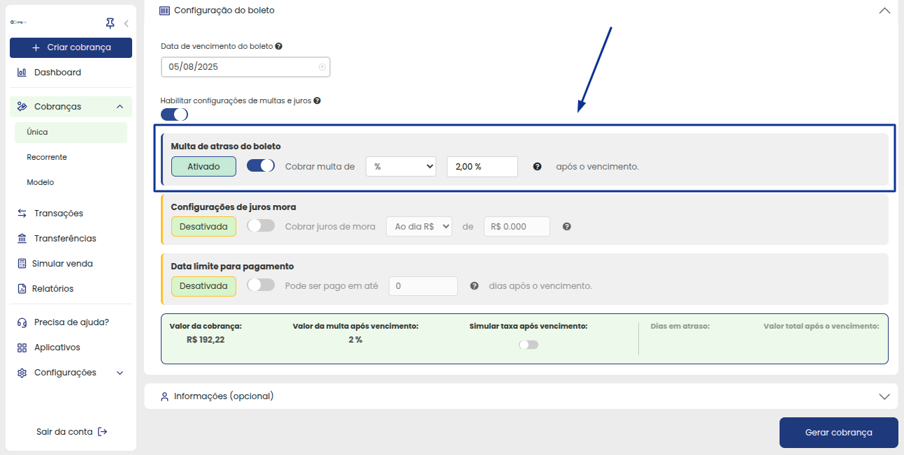
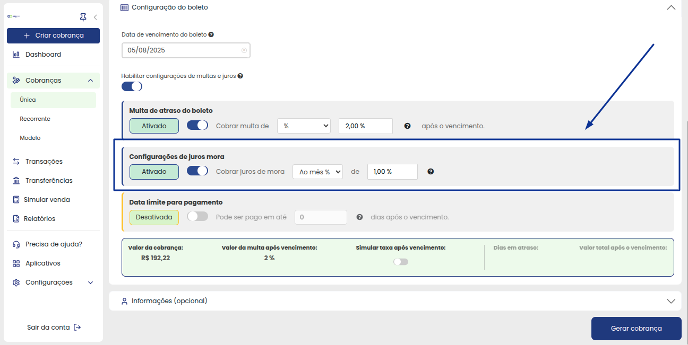

# ➕ Criar Cobrança

**Configuração da Cobrança**

De início você tem a Configuração da cobrança, onde pode identificar o tipo de cobrança que será gerada, o valor e até definir se ela sera Avulsa ou um modelo a ser utilizado outras vezes.

**Formas de Pagamento**

Após preencher os dados iniciais da cobrança, você precisa escolher as formas de pagamento para o cliente (Caso você não defina, por padrão nós deixaremos disponíveis ao cliente as opções Cartão de Crédito e Pix)

**Cartão de Crédito**

Neste momento você precisará definir a quantidade de parcelas (Caso seja Cartão de credito), Marcar se as taxas da cobrança será repassadas ao cliente ou não. Caso seja repassada, defina o valor no último campo, assim como o exemplo abaixo:

**Pix**

Para a opção de pagamento via Pix o parcelamento fica desabilitado, mas será possivel adicionar a Taxa de Transação para o cliente pagar, caso queira:

**Boleto**

Na forma de pagamento Boleto Bancário, você só terá disponível a opção de adicionar a Taxa de Transação para o cliente, nao sendo possivel fazer parcelamento.

Observe que um novo menu de opções será mostrado:

Neste menu será possível configurar a Multa de atraso do boleto, podendo cobrar até 2% sobre o valor de pagamento em caso de atrasos:

Pode também configurar o Juro Mora, sendo disponível colocar 1% ao mês no máximo:

**Informações do Cliente**

Na parte de informações do cliente você pode preencher no momento de gerar a cobrança, ou deixar para que o cliente preencha no momento que for efetuar o pagamento, tornando assim mais ágil as emissões:

