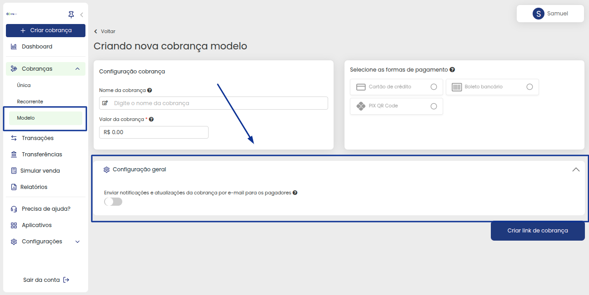

# ➕ Criar Cobrança

<strong>Configuração da Cobrança</strong>
 

De início você tem a Configuração da cobrança, onde pode identificar o tipo de cobrança que será gerada, o valor e até definir se ela sera Avulsa ou um modelo a ser utilizado outras vezes.

<strong>Formas de Pagamento</strong>
 

Após preencher os dados iniciais da cobrança, você precisa definir a forma de pagamento para o cliente (Caso você não defina, por padrão nós deixaremos disponíveis ao cliente as opções Cartão de Crédito e Pix):

<strong>Configuração de Parcelas e Taxas</strong>
 

Neste momento você precisará definir a quantidade de parcelas (Caso seja Cartão de credito), Marcar se as taxas da cobrança será repassadas ao cliente ou não. Caso seja repassada, defina o valor no último campo, assim como o exemplo abaixo:

<strong>Informações do Cliente</strong>
 

Na parte de informações do cliente você pode preencher no momento de gerar a cobrança, ou deixar para que o cliente preencha no momento que for efetuar o pagamento, tornando assim mais ágil as emissões: 

