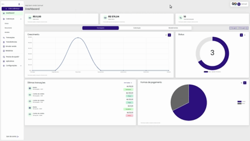
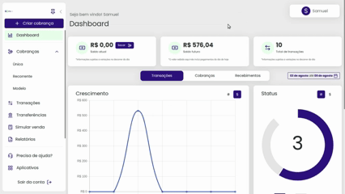

# ➕ Criar cobrança

Deixamos facilitado o acesso a criação de uma cobrança, já no momento que você faz login na nossa plataforma da GOPag o botão de criar cobrança fica disponível para você clicar em dois locais:
- O primeiro local é ao lado esquerdo no início do menu recolhível:
- 

- O segundo local é no dashboard na aba de cobranças:
- 

Ao clicar em uma das duas opções listadas, você abre a configuração da criação de cobrança, onde pode identificar o tipo de cobrança que será gerada, valor, e escolher um dos tipos disponíveis, sendo eles:

## [**Avulsa**](https://docs.gopag.com.br/criar_cobranca/link_cobranca)

Quando falamos de cobrança do tipo avulsa nos referimos a um pagamento único ou pontual que é feito por um produto ou serviço específico, sem a necessidade de um compromisso contínuo. Como exemplo a compra de um item em uma loja online e pagar por ele uma única vez.

## [**Modelo**](https://docs.gopag.com.br/criar_cobranca/link_cobranca/link_cobranca_modelo)

A cobrança modelo ao ser gerada, cria um link único que pode ser utilizado diversas vezes para pagamento de um valor fixo, e para cada transação nesse único link você terá a informação completa de quem efetuou o pagamento, tudo isso e muito mais na nossa  plataforma da GOPag.

<!-- # [**Recorrente**](https://docs.gopag.com.br/criar_cobranca/link_cobranca/link_cobranca_recorrente)

O pagamento recorrente é um método de cobrança periódica, feita com recorrência mensal, quinzenal ou anual enquanto o contrato de serviço durar. Entre os serviços que utilizam o sistema de pagamento recorrente, podemos falar de cursos, contabilidade, mensalidade escolar, honorários, editoras e empresas de telecomunicações.
 -->
