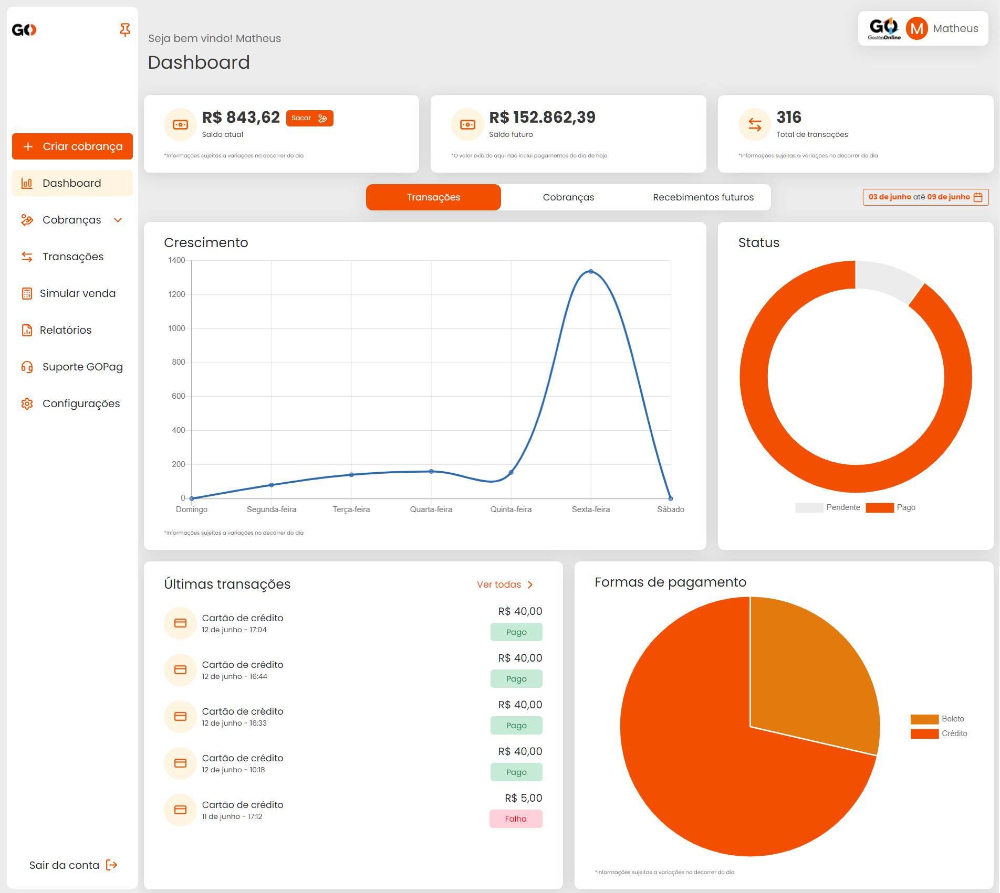
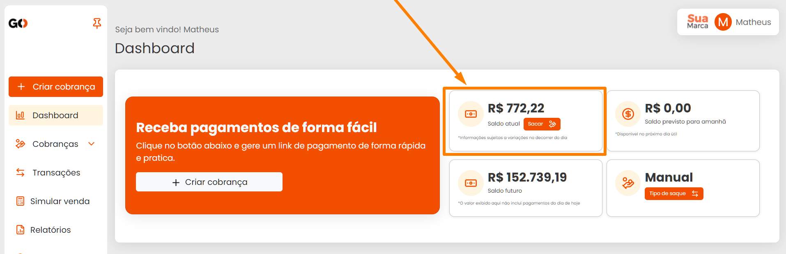
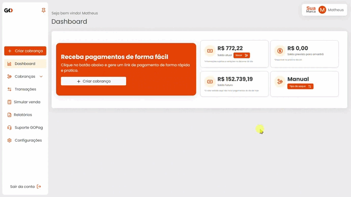
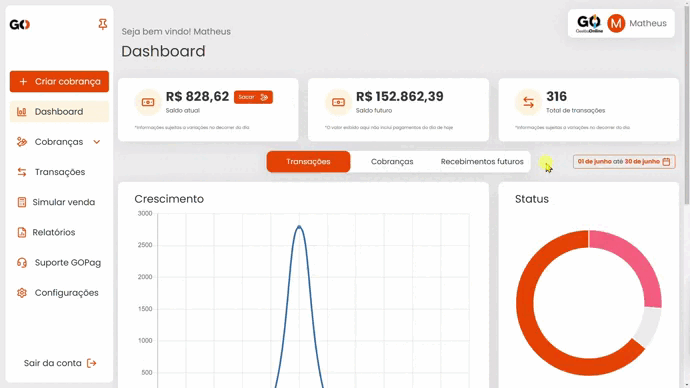
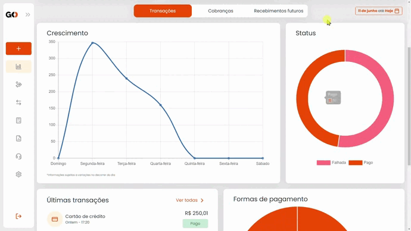
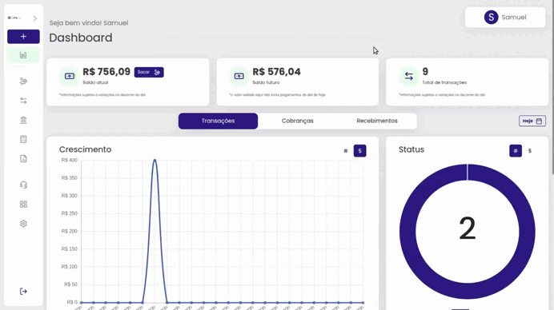
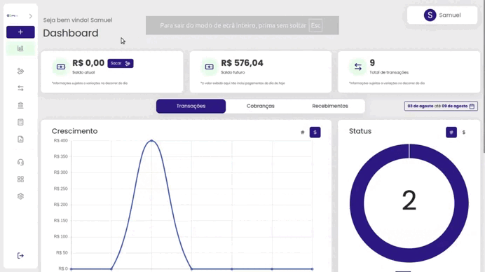

# 📱 Dashboard

Na tela principal da plataforma **GOPag**, você encontra informações com seu saldo atual, saldo futuro ou total de transações.
Você também pode ver os gráficos de transações, cobranças, e até o calendário com recebimentos futuros:

No primeiro card você tem disponível o botão para sacar o valor do saldo atual, mas vale uma atenção a mais nesta parte, pois este botão só aparece para você, caso tenha optado por utilizar o tipo **`Saque manual`**:

Clicando neste botão você será direcionado para uma janela pop-up solicitando o valor a ser sacado, após inserir o valor e clicar em confirmar saque, ele será agendado a transferência bancária para a conta que estiver ativa no momento:


**Atenção:** Para mais informações sobre a **conta bancária cadastrada**, [**`clique aqui`**](https://docs.gopag.com.br/configuracoes#conta-bancaria)


Descendo um pouco mais em nosso dashboard, você pode ver os gráficos e a tabela com as informações de transações. Essas informações podem ser alteradas se você alterar a data de exibição, sendo por semana, ou por mês.

Observe nosso teste abaixo com as duas opções:

Agora marcando a opção mensal:

 

Na parte final, temos um pequeno relatório com ás últimas cinco transações, e deixamos um atalho para você ir direto ao menu de todas as transações:


**Atenção:** Para mais informações sobre **transações**, [**`clique aqui`**](/TRANSACOES/README.md)


 

**Mas as opções do nosso dashboard não para por aí! 😁**

Clicando na opção cobranças que está logo ao lado de transações, você tem uma nova tela a ser exibida, agora com gráfico de crescimento, um botão de atalho para você criar uma nova cobrança, o relatório das últimas cobranças geradas e o status dessas cobranças. 

Lembrando que tudo é influênciado pela data que você determina


**Atenção:** Para mais informações sobre **transações**, [**`clique aqui`**](/TRANSACOES/README.md)


