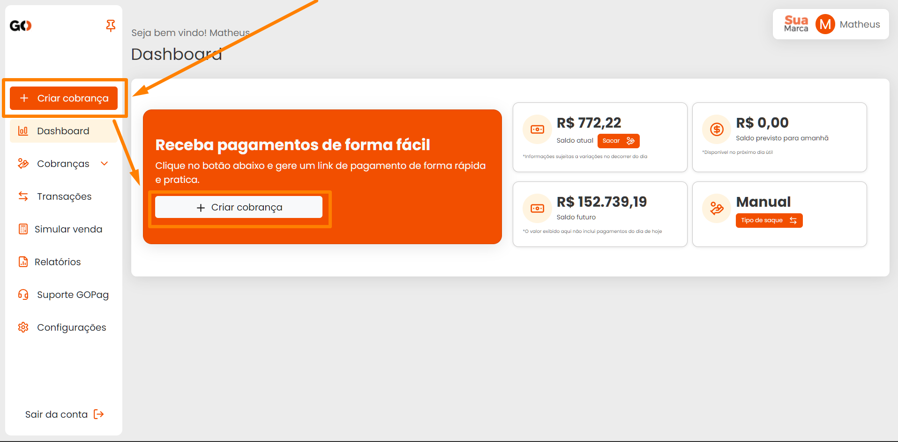

# 📱 Dashboard

Na tela principal da plataforma **GOPag**, você encontra informações com seu saldo atual, saldo previsto para o próximo dia, o saldo futuro e o método de saque desses valores que você deixou predefinido:


**Atenção:** Para mais informações sobre os tipos de saque disponíveis e como deixar definido, [**`clique aqui`**](/CONFIGURACOES/README.md)


De início você tem o botão de atalho para gerar uma nova cobrança, ele está presente em dois locais, assim que você faz login na plataforma:

Ambos os botões irão te direcionar para a criação de uma nova cobrança, seja ela do tipo avulsa, ou modelo.


**Atenção:** Para mais informações sobre como criar uma cobrança, [**`clique aqui`**](/CRIAR_COBRANCA/README.md)


Logo ao lado, você tem disponível o botão para sacar o valor do saldo atual, fique atento, pois este botão só aparece para você caso tenha optado por utilizar o tipo de saque manual:

Clicando neste botão você será direcionado para uma janela pop-up solicitando o valor a ser sacado, após inserir o valor e clicar em confirmar saque, ele será agendado a transferência bancária para a conta que estiver ativa no momento:


**Atenção:** Para mais informações sobre a conta bancária cadastrada, [**`clique aqui`**](/CONFIGURACOES/README.md)


Observe que o botão some a partir do momento que deixo definido o tipo de saque. Como neste exemplo utilizamos o método de saque automático mensal, uma mensagem é exibida logo abaixo do botão `Tipo de saque` informando o dia de previsão de saque. Confira abaixo:

