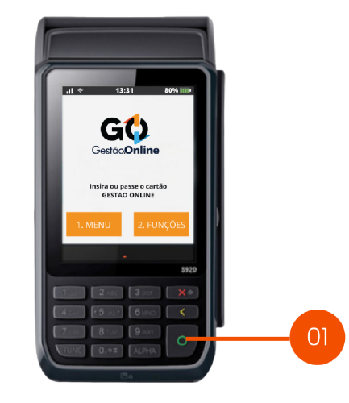
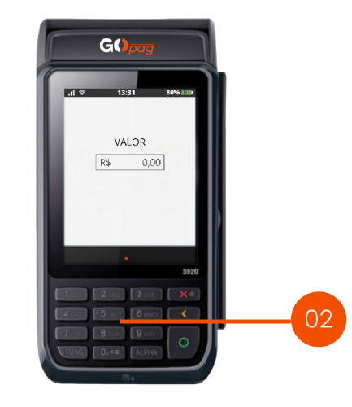
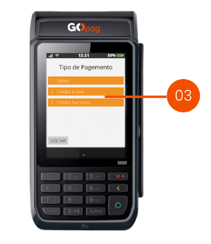
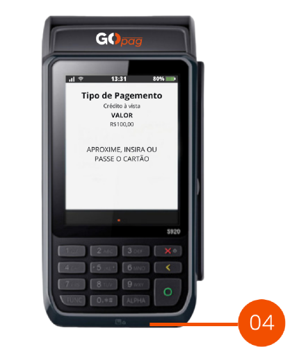

# 🛍️ Realizar uma venda

**Passo 1 -** Para iniciar uma venda, na tela inicial, clique no botão "<mark style="color:orange;">Confirmar</mark>".

\

**Passo 2 -** Digite o valor da venda utilizando o teclado numérico, após isso, clique em "<mark style="color:orange;">Confirmar</mark>".

**Passo 3 -** Selecione o tipo de pagamento:

1. Para vender no Débito.
2. Para vender no Crédito.
3. Para vender Parcelado.

\

**Passo 4 -** Peça para que o cliente aproxime ou insira o cartão e digite a senha para finalizar a venda.

\
