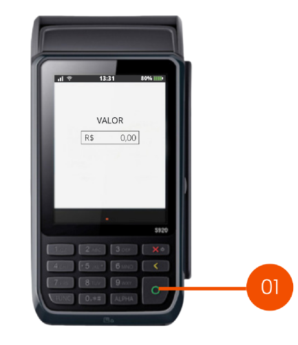
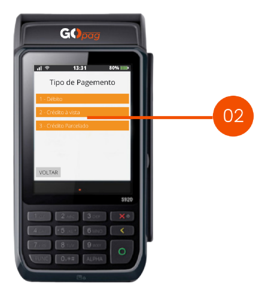
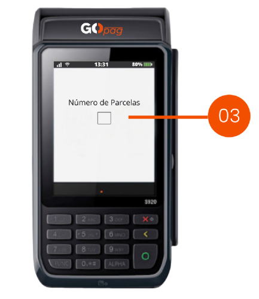
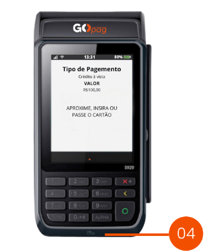

# 💸 Venda parcelada

**Passo 1 -** Inicie uma venda. Digite o valor da venda utilizando o teclado numérico, após digitar o valor, clique em "<mark style="color:orange;">Confirmar</mark>".

\

**Passo 2 -** Selecione a opção 03 para pagamento parcelado.

\

**Passo 3 -** Digite o número de parcelas utilizando o teclado numérico, após digitar o número de parcelas clique em "<mark style="color:orange;">Confirmar</mark>".

\

**Passo 4 -** Peça para que o cliente aproxime ou insira o cartão e digite a senha para finalizar a venda.
