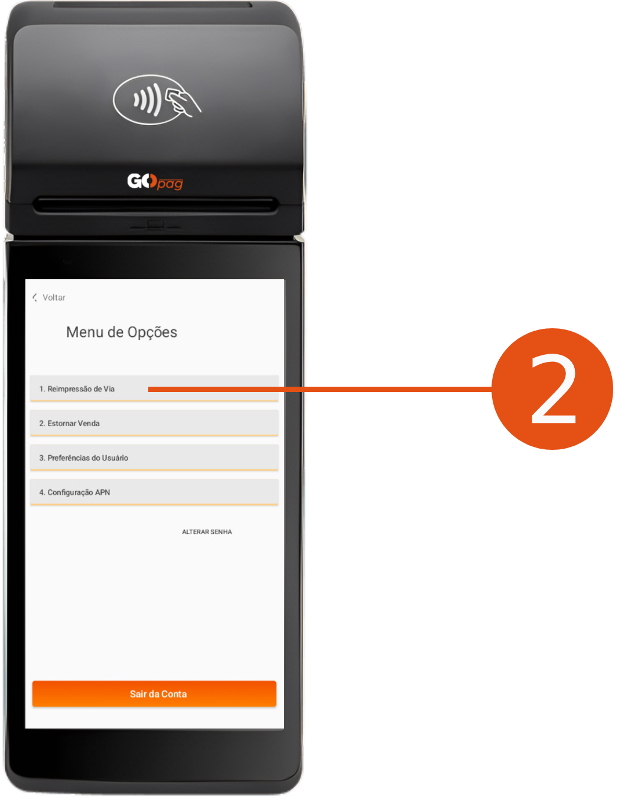
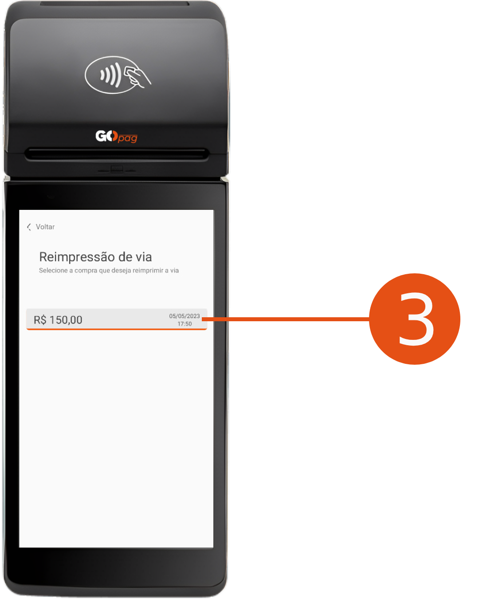

# 🔄️ Reimpressão da Via

\

**Passo 1 -** Acesse o menu clicando em "<mark style="color:orange;">1. Menu de Opções</mark>" na página inicial e digitando a senha.

\

**Passo 2 -** Selecione a opção "<mark style="color:orange;">1. Reimpressão de via</mark>".

\

**Passo 3 -** Selecione qual venda deseja fazer a reimpressão.

\

**Passo 4 -** Selecione se quer reimprimir para o "<mark style="color:orange;">Negócio</mark>" ou "<mark style="color:orange;">Cliente</mark>" e aguarde a reimpressão da via.

 
