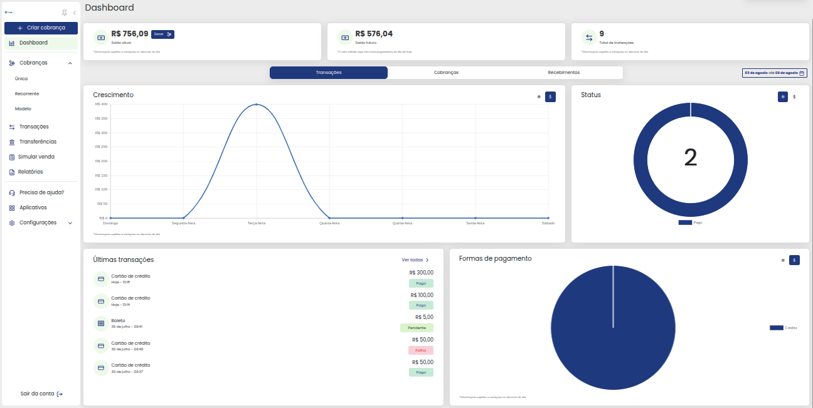
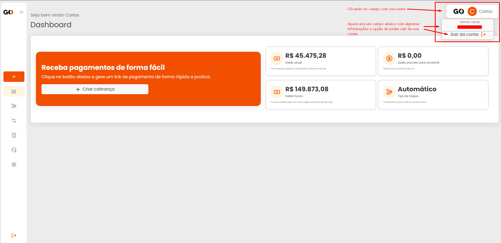
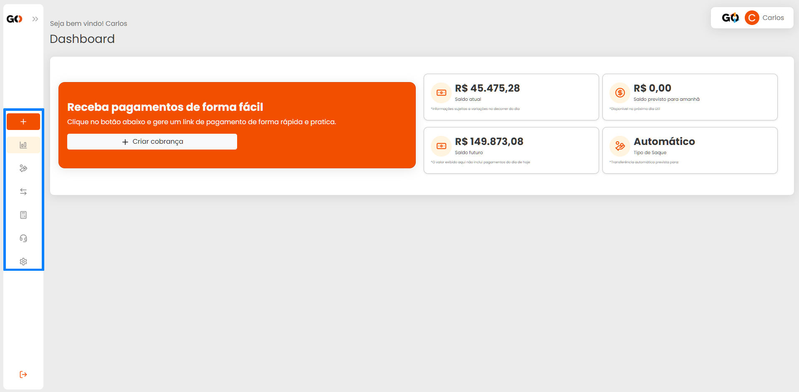
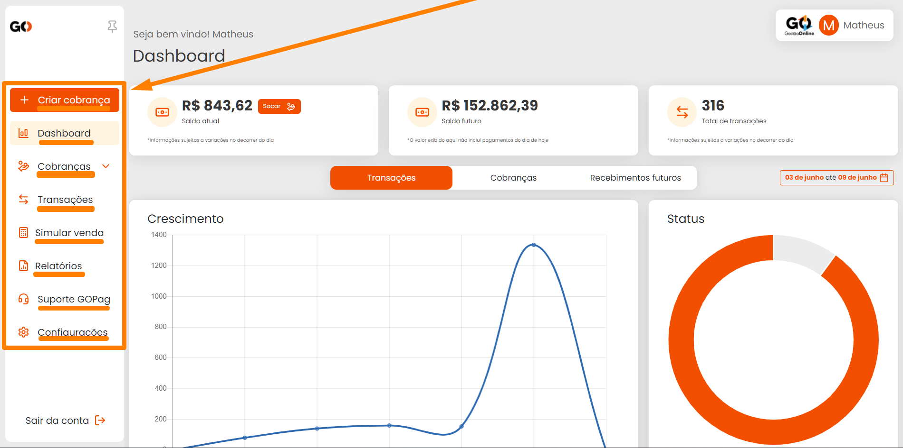
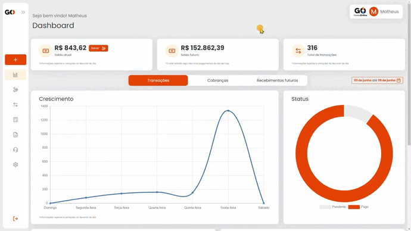
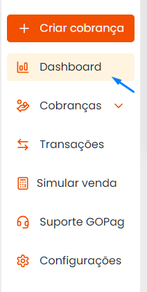

# ↕️ Menus de navegação

Ao acessar seu ambiente GOPag, nesse primeiro momento será a hora de conhecer a aplicação que está utilizando!

Sua tela inicial será similar ao que consta na imagem da tela teste abaixo:

Porém com suas informações de saldo!

Agora, voltando nossa atenção para o canto superior direito da tela, podemos visualizar um campo com seu nome incluso. Clicando sobre este campo, uma janelinha irá aparecer logo abaixo do seu nome com algumas informações:

- Nome da empresa e o CNPJ da mesma, isso para planos de conta do tipo Pessoa Jurídica;
- Nome da pessoa e CPF, este sendo para Pessoas Físicas; 
- A última opção é a de sair/logout da conta.

Você pode observar esses detalhes na imagem abaixo:

Olhando agora para o lado esquerdo da tela pode-se visualizar uma coluna com algumas figuras.

**Essas figuras são as opções de menu!**

Quando passamos a setinha do mouse por cima desta coluna ela irá se expandir e com isso os nomes de cada ícone irá aparecer.

Clicando no ícone de fixar 📌, o seu menu lateral irá ficar sempre com o tamanho cheio, você pode ver além dos ícones os nomes de cada um deles. 😉👍

Além disso, tem mais um detalhe que é essencial para podermos nos localizarmos dentro da plataforma. Quando selecionamos um menu, ele ficará destacado em uma cor laranja claro.

Isso foi pensado justamente para poder facilitar nossa navegação dentro da plataforma.

**Incrível, não é mesmo!**

Portanto, prepare-se, pois estamos prestes a conhecer cada uma das áreas disponíveis dentro da plataforma GOPag!