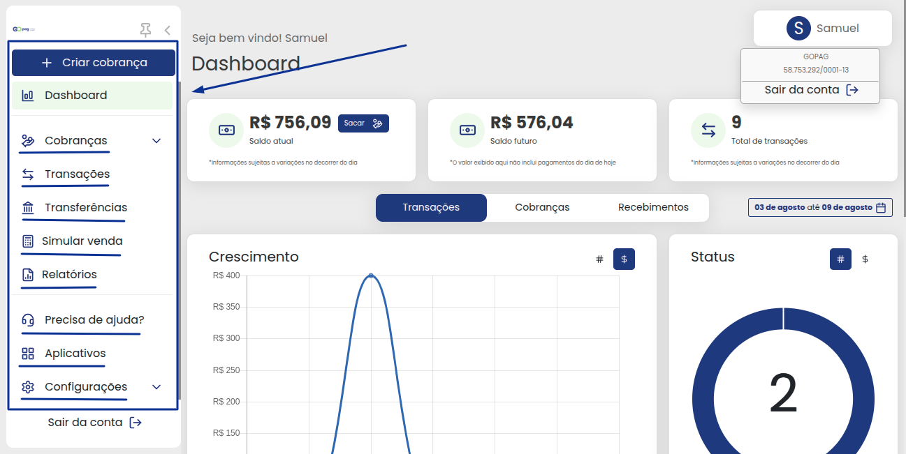

# ↕️ Menus de navegação

Ao acessar seu ambiente **GOPag**, nesse primeiro momento será a hora de conhecer a aplicação que está utilizando!

Sua tela inicial será similar ao que consta na imagem da tela de teste abaixo:

**Porém, com suas informações de saldo!**

Agora, voltando nossa atenção para o canto superior direito da tela, podemos visualizar um pequeno card com seu nome incluso. Clicando sobre este card, uma janelinha irá aparecer logo abaixo do seu nome com algumas informações:

- Nome da empresa e o CNPJ, isso para planos de conta do tipo pessoa jurídica;
- Nome da pessoa e CPF, este sendo para pessoas físicas; 
- A última opção é a de sair/logout da conta.

Você pode observar esses detalhes na imagem abaixo:

Olhando agora para o lado esquerdo da tela pode-se visualizar uma coluna com algumas figuras.

**Essas figuras são as opções de menu!**

Quando passamos a setinha do mouse por cima desta coluna ela irá se expandir e com isso os nomes de cada ícone irá aparecer.

Clicando no ícone de fixar 📌, o seu menu lateral irá ficar sempre com o tamanho cheio, você pode ver além dos ícones os nomes de cada um deles. 😉👍

| | |
|-|-|
| | Além disso, tem mais um detalhe essencial para podermos nos localizarmos dentro da plataforma. Quando selecionamos um menu, ele ficará destacado em uma cor laranja-claro.    Isso foi pensado justamente para poder facilitar sua navegação dentro da plataforma.   **Incrível, não é mesmo!**   Portanto, prepare-se, pois estamos prestes a conhecer cada uma das áreas disponíveis dentro da plataforma **GOPag**! |

