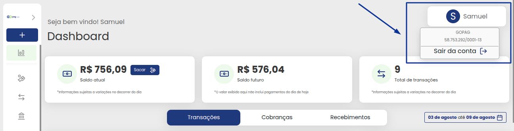

# ↕️ Menus de Navegação

Ao acessar seu ambiente GOPag, nesse primeiro momento será a hora de conhecer a aplicação que está utilizando!

Sua tela inicial será similar ao que consta na imagem da tela teste abaixo:

Porém com suas informações de saldo!

Agora, voltando nossa atenção para o canto superior direito da tela, poderemos visualizar um campo com nosso nome incluso. Clicando sobre este campo, uma janelinha irá aparecer logo abaixo do nosso nome com algumas informações, geralmente o nome da empresa e o cnpj da mesma e a opção de poder sair da conta. 
Podemos ver esses detalhes na imagem abaixo:

Olhando agora para o lado esquerdo da tela poderemos visualizar uma coluna com algumas figuras.
 

Essas figuras são as opções de menu

