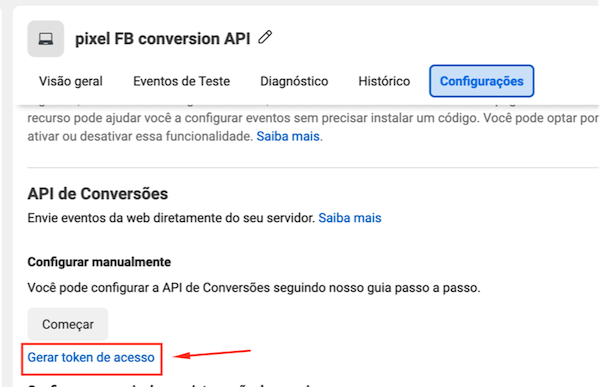
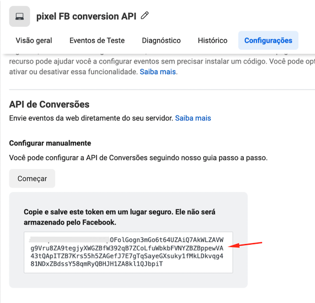
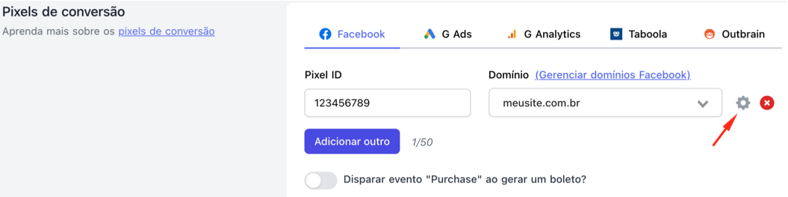

# 🧩 API de Conversão do Facebook

### Como configurar a API de Conversão do Facebook

A API de conversão ajuda o seu Pixel a ter mais precisão e rastrear as vendas corretamente.

Ela é uma **opção adicional** de rastreio, e não interfere no funcionamento do pixel comum. Você continuará usando o Pixel convencional.

Os eventos da API de conversão nunca duplicarão com os do Pixel convencional, pois em cada evento passamos um ID único, e o Facebook se encarrega de evitar duplicações.

Em resumo: Você só tem a ganhar implementando a API de conversões. É um adicional que irá melhorar as suas campanhas!

### Pegando o Token da API de Conversão no Facebook

Em **Fontes de Dados**, acesse o seu **Pixel do Facebook** e clique na guia **Configurações**.

Desça a tela até a seção da API de Conversões e clique no link **Gerar token de acesso**.

Aparecerá uma caixinha com o Token da API de conversão. Copie ele inteiro.

### Colocando o Token da API de conversão na plataforma da GoPag

No painel da plataforma da GoPag, edite o produto que você quer configurar a API de conversões, e na seção de **Configurações > Pixels do Facebook**, clique no ícone de configurações.

Então, cole o Token da API e salve.

Pronto! A API de conversões foi configurada corretamente!

Você deverá repetir esse processo para cada novo produto que criar, ou se quiser usar várias contas do Facebook ao mesmo tempo.

Lembrando que a API de conversão não é obrigatória, e é possível ter ao mesmo tempo, Pixels com e sem API de conversão.
