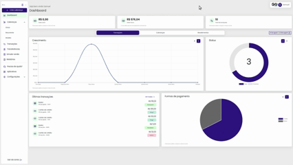
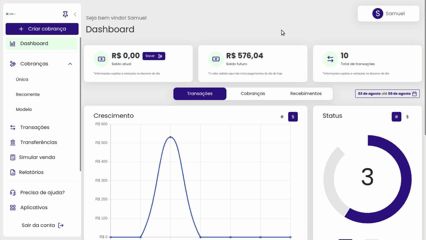

# ➕ Criar Cobrança

O acesso à criação de uma cobrança é facilitado, já no momento do login na plataforma da GoPag o botão de criar cobrança fica disponível em dois locais:

O primeiro lugar é ao lado esquerdo do início do menu que se recolhe.

 

O segundo local é no dashboard na aba de cobranças:

Ao clicar em uma das duas opções listadas, você abre a configuração da criação de cobrança, onde pode identificar o tipo de cobrança que será gerada, valor, e escolher um dos tipos disponíveis, sendo eles:

## [**Avulsa**](https://docs.gopag.com.br/portal_gopag/criar_cobranca/link_cobranca)

Quando falamos de cobrança do tipo avulsa nos referimos a um pagamento único ou pontual feito por um produto, ou serviço específico, sem a necessidade de um compromisso contínuo. Como exemplo a compra de um item em uma loja online e pagar por ele uma única vez.

## [**Modelo**](https://docs.gopag.com.br/portal_gopag/criar_cobranca/link_cobranca/link_cobranca_modelo)

A cobrança modelo ao ser gerada, cria um link único que pode ser utilizado diversas vezes para pagamento de um valor fixo, e para cada transação nesse único link haverá a informação completa de quem efetuou o pagamento, tudo isso e muito mais na plataforma da GoPag.
