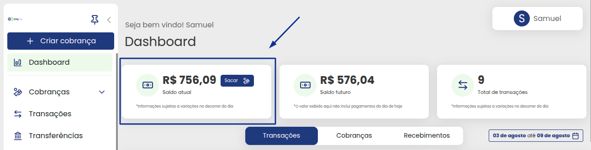
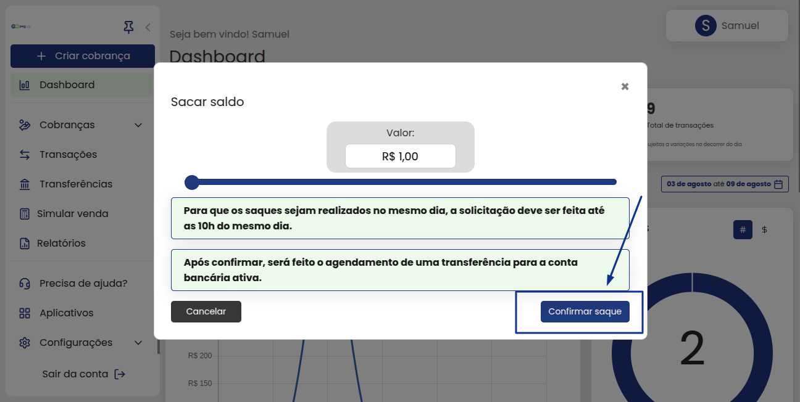
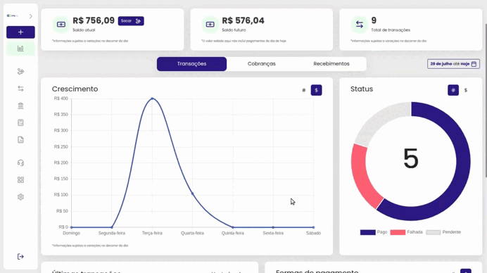
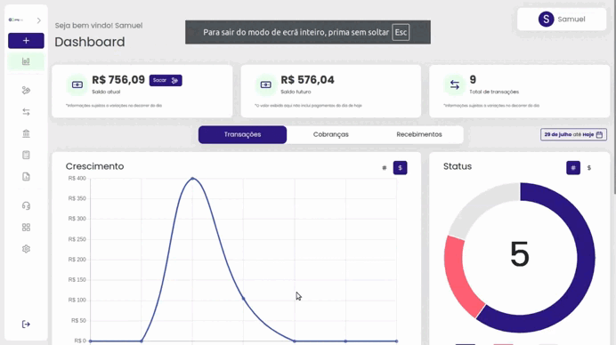
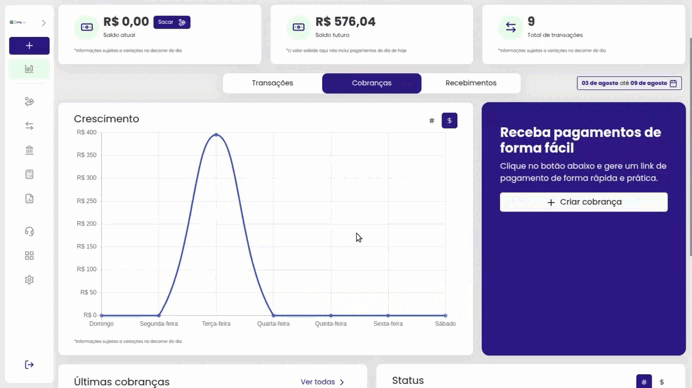
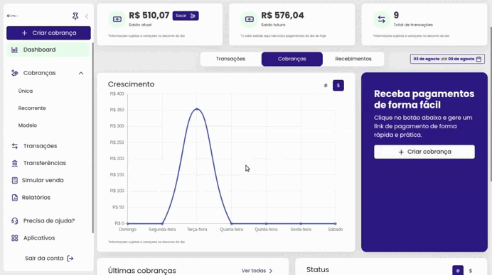

# 📊 Dashboard

Na tela principal da plataforma **GOPag**, há informações com o saldo atual, saldo futuro ou total de transações.

Também é possível ver os gráficos de transações, cobranças, e até o calendário com recebimentos futuros:

No primeiro card está disponível o botão para sacar o valor do saldo atual, mas vale uma atenção a mais nesta parte, pois este botão só aparece caso tenha sido optado por utilizar o tipo **`Saque manual`**:

Clicando neste botão você será direcionado para uma janela pop-up solicitando o valor a ser sacado, após inserir o valor e clicar em confirmar saque, ele será agendado a transferência bancária para a conta que estiver ativa no momento:


**Atenção:** Para mais informações sobre a **conta bancária cadastrada**, [**`clique aqui`**](https://docs.gopag.com.br/portal_gopag/configuracoes#conta-bancaria)


Descendo um pouco mais no dashboard, é possível ver os gráficos e a tabela com as informações de transações. Essas informações podem ser alteradas se for alterada a data de exibição, sendo por mês, semana ou dia;

Observe nosso teste abaixo com as três opções, primeiro com o mensal:

Agora definindo a data para uma semana:

E por último definindo para somente um dia:

 

Na parte final, há um pequeno relatório com as últimas cinco transações, e um atalho para ir direto ao menu de todas as transações:


**Atenção:** Para mais informações sobre **transações**, [**`clique aqui`**](../TRANSACOES/)


 

**Mas as opções do dashboard não param por aí! 😁**

Clicando na opção cobranças que está logo ao lado de transações, há uma nova tela a ser exibida, agora com gráfico de crescimento, um botão de atalho para criar uma nova cobrança, o relatório das últimas cobranças geradas e o status dessas cobranças.

Lembrando que tudo é influenciado pela data que você determina


**Atenção:** Para mais informações sobre **transações**, [**`clique aqui`**](../TRANSACOES/)


E fechando a explicação sobre todas as funções disponíveis no dashboard da plataforma da GOPag, há o calendário com os recebimentos futuros, projetado justamente para ter mais controle dos recebimentos.

Observe que ao clicar em um recebimento futuro, um novo card é exibido com todas as informações referentes:

Nesse mesmo calendário há disponível outras funções, por exemplo, exibir por semana e um botão para o calendário ir direto ao dia atual, demonstramos abaixo o uso dessas opções 😁

