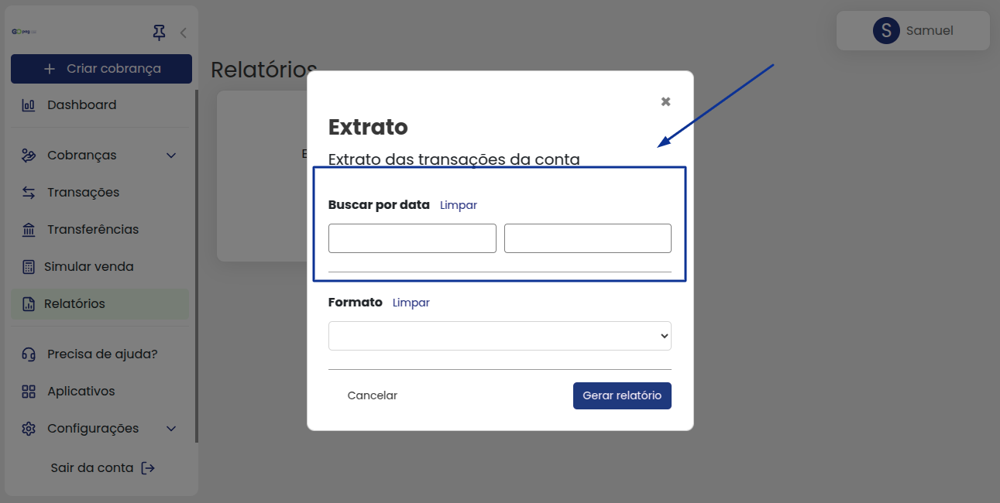
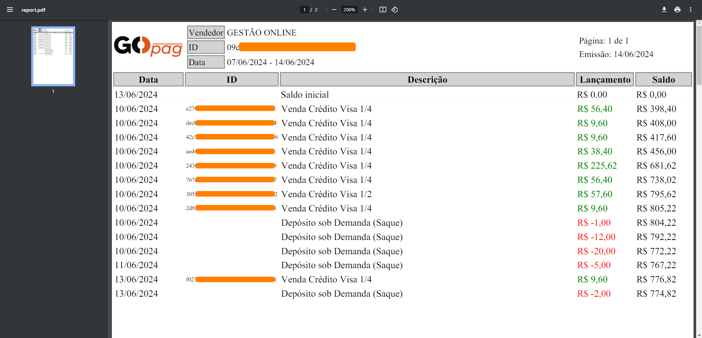

# 🧾 Relatórios

Os relatórios podem ser gerados de forma simples, apenas com alguns cliques na plataforma. Logo abaixo, o card que aparece disponível para utilização é o de **`Extrato`**:


**Importante:** Os extratos podem ser gerados em dois formatos,  PDF ou  Excel, escolha o que melhor se aplicará para você.


Você pode definir a data de início e fim do extrato que deseja fazer conferência:

E na sequência qual formato deseja fazer o download.


**Informação:** É importante lembrar que a versão em Excel é editável, permitindo que você copie os dados com mais facilidade. No entanto, o relatório em formato PDF é um pouco diferente, focando mais na leitura das informações.


Observe abaixo o modo de emissão de um relatório:

Analisando melhor relatório gerado em PDF, você pode ver a data que foi feita a transação, o ID para fazer uma busca na plataforma (caso seja necessário), descrição da transação, lançamento, se é de entrada ou saída de valor e o saldo final.


**Informação:** Observe que na coluna `Lançamento` nós colocamos as cores <mark style="color:green;background-color:white;">`verde`</mark> para entrada de valor e <mark style="color:red;background-color:white;">**`vermelho`**</mark> para saída valor, tudo isso para facilitar sua análise no relatório.


