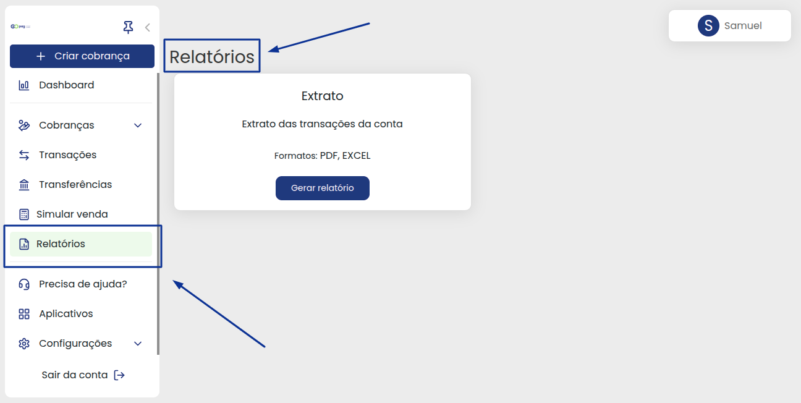
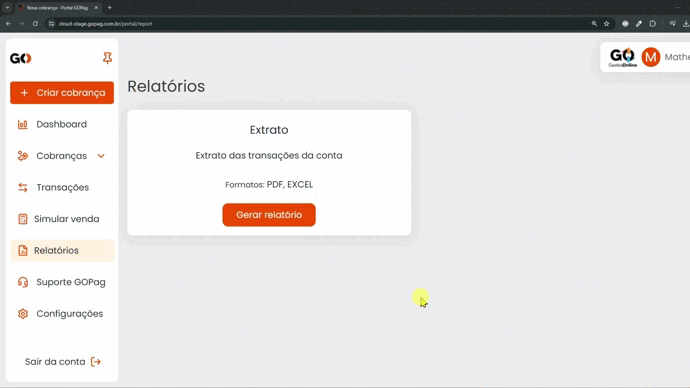

# 🧾 Relatórios

<!-- Os relatórios gerados pela plataforma da GOPag, oferecem benefícios como decisões assertivas, controle de estoque, conformidade regulatória e análise de desempenho. Eles basicamente são ferramentas essenciais para uma gestão eficiente, se baseando nos dados gerados: -->

Os relatorios podem ser gerados de forma simples, apenas com alguns cliques na plataforma. Logo abaixo  card que aparece disponível para utilização é o de `Extrato`:


**Importante:** Os extratos podem ser gerados em dois formatos, PDF ou Excel, escolha o que melhor se aplicará para você.


Você pode definir a data de inicio e fim do extrato e na sequência qual formato deseja fazer o download.

Lembrando que a versão em excel é editável e você pode copiar mais fácil os dados, agora em PDF o relatório é um pouco diferente, mais focado na leitura das informações.

Observe abaixo o modo de emissão de um relatório:

