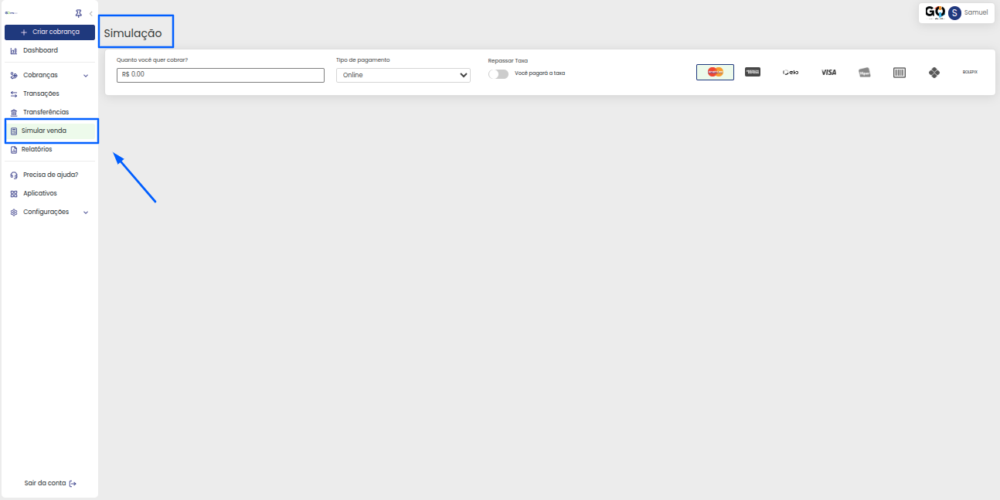
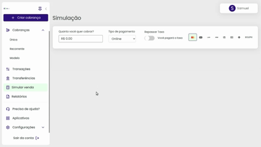

# 🔢 Simular venda

É possível simular valores na plataforma da GOPag antes de você gerar a cobrança ao cliente. Podendo até testar com taxas e acréscimos em valores e condições diferentes para seu cliente, tudo isso antes de gerar o link da cobrança:

 

Bem fácil de se utilizar, bastando inserir o valor desejado para a simulação de taxas e parcelas, são quatro funções disponíveis, entre elas, o valor que você quer cobrar, que seria o da cobrança em si, o tipo de pagamento, se será online ou presencial e qual a bandeira do cartão a ser utilizado.


**Detalhe:** Cada bandeira de cartão pode ter variação na porcentagem de taxa a ser cobrada, observe bem estes valores 😉


 

No **`Tipo de pagamento`** colocamos duas opções, a online e presencial, o cálculo é feito com doze parcelas e incluso até o cartão de débito, lembrando que o cartão de débito funciona somente no modo presencial:

No menu simular venda, você pode marcar o botão **`Repassar taxas`** para saber qual valor será necessário repassar ao cliente (caso seja este o seu desejo) e então criar uma cobrança já baseada nesse valor, confira abaixo o exemplo do simulador:


**Informação:** A partir do plano escolhido, os recursos são cobrados em modelo de assinatura e cobranças mensais. Se necessário, somam-se taxas de configuração inicial e tarifas variáveis.

