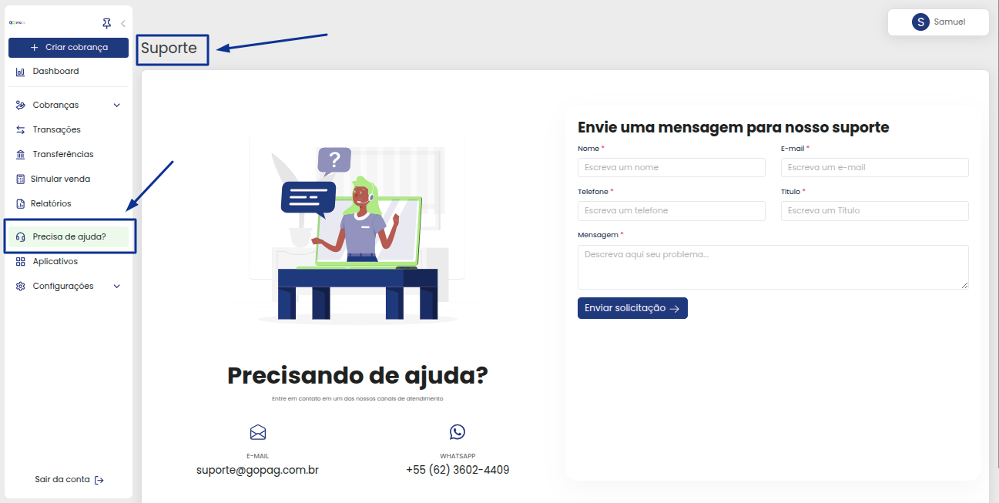
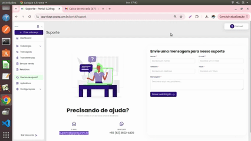

# 🆘 Suporte

Em caso de problemas com a nossa plataforma, ou algo fora do comum e que não esteja conforme a normalidade do nosso sistema, você pode nos contatar pelo suporte para que nossa equipe ajude o mais rápido possível:

 

Você pode falar conosco direto pelo WhatsApp clicando no ícone, e será encaminhado ao mensageiro automaticamente, conforme exemplo abaixo:

 

Ou pode usar o nosso portal para suporte, que estaremos prontos para lhe atender, bastando apenas preencher todos os dados necessários e aguardar nosso contato.

Pedimos sempre que explique bem o problema ou ajuda que está precisando, para podermos auxiliar da melhor e mais ágil forma, com nossa equipe de suporte 😉


**Importante:** Na solicitação de suporte, você precisa preencher todos os campos que estão com asterisco vermelho, para que a mensagem seja enviada até nós, quando clicar no botão enviar solicitação!


 

Você pode também nos enviar um email, em caso de ajuda ou dúvida, para o [suporte@gopag.com.br)](suporte@gopag.com.br), lembrando de tentar explicar o mais detalhadamente possível a situação para podermos te ajudar o mais breve possível, conforme exemplo abaixo:

