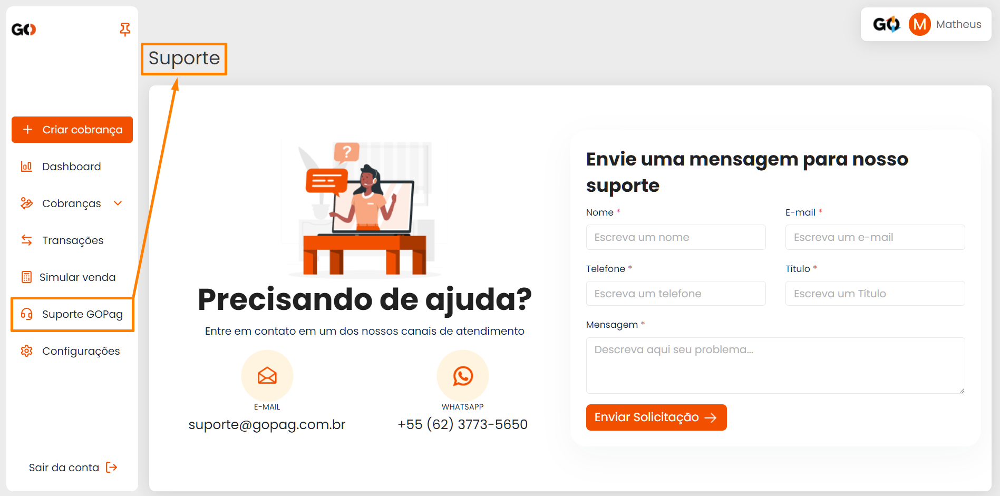
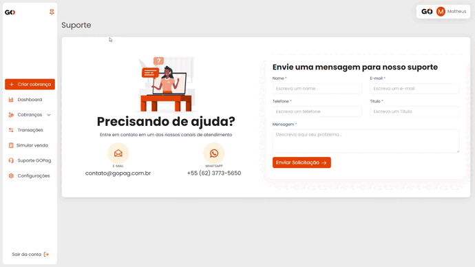
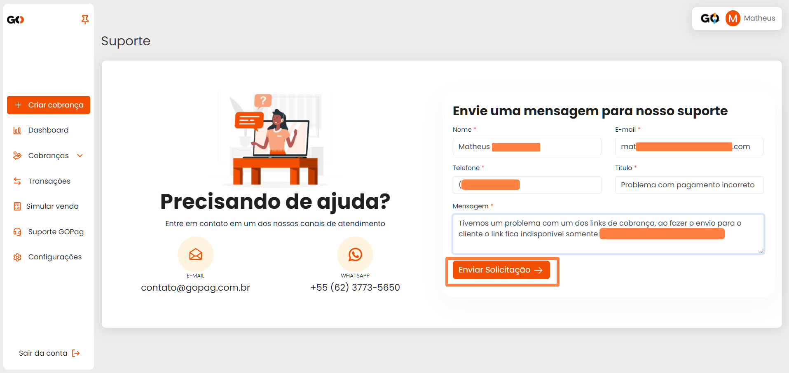
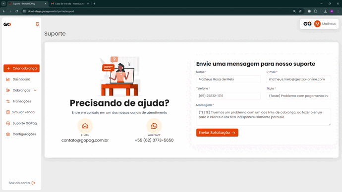

# Menu Suporte

Em caso de problemas com o sistema, ou algo fora do comum e que não esteja de acordo com a normalidade do nosso sistema, você pode nos contatar pelo Suporte para que nossa equipe ajude o mais rápido possível:

 

Você pode falar conosco direto pelo Whatsapp clicando no icone que será encaminhado ao mensageiro automanticamente, conforme exemplo abaixo:

 

Ou pode usar o nosso Portal para suporte que estaremos pronto para lhe antender, bastando apenas preencher todos os dados necessários e aguardar nosso contato. Pedimos sempre que explique bem o problema ou ajuda que está precisando para que possamos auxiliar da melhor e mais ágil forma com nossa equipe de Suporte 😉 


**Importante:** No preenchimento da solicitação de suporte você precisa preencher todos os campos que estão com asterisco vermelho, para que a mensagem possa ser enviada!


 

Você pode também nos enviar um e-mail em caso de ajuda ou dúvidas maiores para o contato@gopag.com.br, lembrando de tentar explicar o mais detalhadamenteo possível a situação para te ajudar o mais breve possível, conforme exemplo abaixo:

.