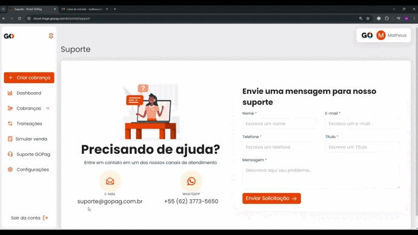

# Menu Suporte

Em caso de problemas com a nossa plataforma, ou algo fora do comum e que não esteja de acordo com a normalidade do nosso sistema, você pode nos contatar pelo Suporte para que nossa equipe ajude o mais rápido possível:

 

Você pode falar conosco direto pelo Whatsapp clicando no ícone, e será encaminhado ao mensageiro automaticamente, conforme exemplo abaixo:

 

Ou pode usar o nosso Portal para suporte, que estaremos prontos para lhe atender, bastando apenas preencher todos os dados necessários e aguardar nosso contato. 

Pedimos sempre que explique bem o problema ou ajuda que está precisando, para que possamos auxiliar da melhor e mais ágil forma, com nossa equipe de Suporte 😉 


**Importante:** Na solicitação de suporte, você precisa preencher todos os campos que estão com asterisco vermelho, para que a mensagem seja enviada até nós, quando clicar no botão Enviar solicitação!


 

Você pode também nos enviar um e-mail em caso de ajuda ou dúvida, para o contato@gopag.com.br, lembrando de tentar explicar o mais detalhadamente possível a situação para que possamos te ajudar o mais breve possível, conforme exemplo abaixo:

