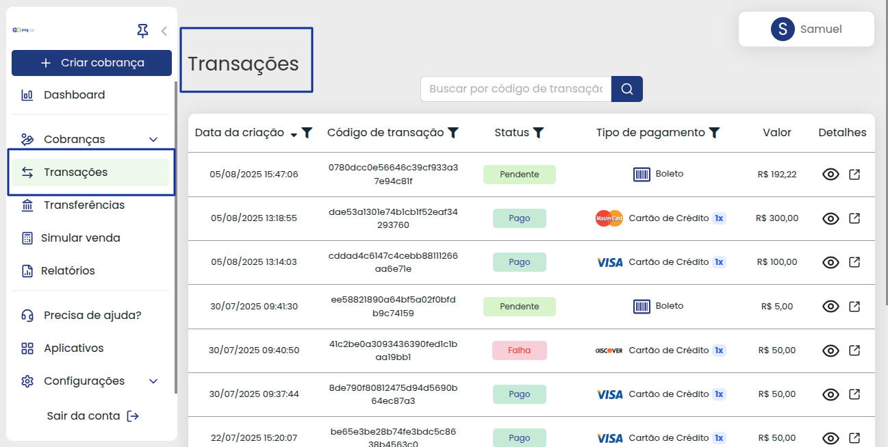
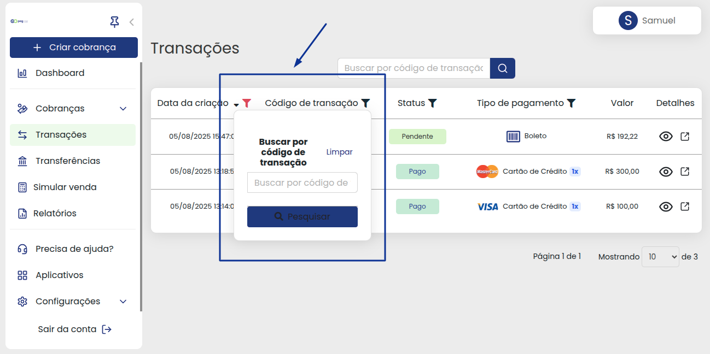
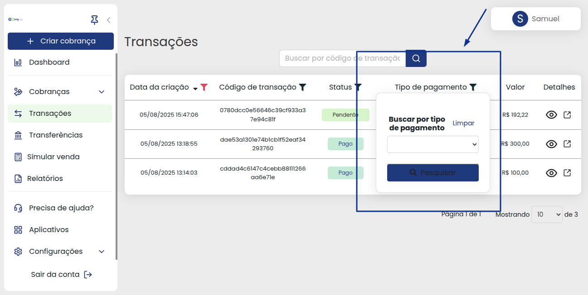
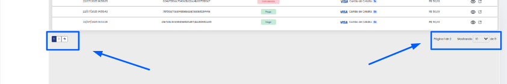

# 🔄️ Transações

Com a plataforma da GOPag sendo omnichannel, neste menu estão organizadas todas as transações realizadas, por máquinas MPOS(Mobile Point os Sale), POS(Point of Sale), PIN Pad, TEF e até mesmo E-commerces parceiros.

Aqui é possível utilizar os filtros para busca, ou a barra de pesquisa, confira melhor nas explicações abaixo:

 

Para ficar mais fácil a busca por uma transação específica, é possível usar a **`barra de pesquisa`** que está marcada na imagem abaixo:


**Importante:** A barra de pesquisa faz uma busca somente pelo **`Código de transação`** da cobrança. 😉


 

Em cada item das transações, há filtros para facilitar a pesquisa por algo mais específico, por exemplo, a opção da **`Data de criação`** escolhendo data de início e término da busca, ou é possível usar um dos atalhos de período que aparecem assim que se abre o calendário, abaixo uma breve demonstração de uso:

 

Também é possível usar o filtro de busca por **`Código de transação`**, ele tem a mesma função que a barra de pesquisa, e é possível utilizar o que for mais prático para o momento:

 

Já o filtro de **`Status`**, traz todas as opções de status disponíveis, lembrando que todos os filtros também podem ser utilizados em conjunto para uma busca específica:

* Pago
* Cancelado
* Pendente
* Falha
* Novo
* Pré-autorizado
* Revertido
* Reembolsado
* Disputa
* Charged back

Confira no exemplo abaixo:

 

Outro filtro importante é o do **`Tipo de pagamento`**, onde você procura pelo método utilizado e pode filtrar melhor, ou usá-lo em conjunto com outro filtro:

 

Em cada transação gerada, é possível observar que na opção **`Detalhes`**, há dois ícones:

*  O ícone do olhinho abrirá o link de cobrança para conferir detalhes sobre ela.
*  E o ícone do quadrado com a setinha, tem quase a mesma função, porém abrirá em uma nova janela.

Passando assim, mais de uma possibilidade para acessar as informações 😉👍


**Detalhe:** Caso queira mais informações sobre detalhes de transação [clique aqui ](https://docs.gopag.com.br/transacoes/detalhes_transacoes)para acessar a explicação sobre cada parte desta função.


 

Logo na parte final das transações fica a paginação, onde é possível aumentar a quantidade visível de cobranças mostradas para até 1000 itens na página:

.

