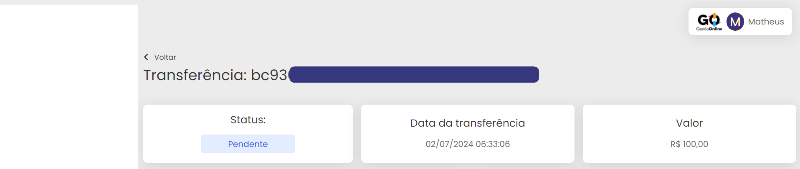

# 📄 Detalhes Transferências

Na tela de detalhes da transferência você tem alguns cards com informações importantes.

No começo da página temos o status da transferência, lembrando que ele tem as opções (Bem-sucedido, Confirmado, Agendado, Cancelado, Pendente, Falha e Criado).

Você também encontra a data e hora da transferência, e logo ao lado o valor solicitado:

Logo mais abaixo, você encontra os dados da transferência com a descrição informando que foi um saque via GOPag e a data da criação da transferência.

Ao lado direito você vê também os detalhes da conta bancária, com as informações do banco que vai receber ou já recebeu a transferência que você criou


**Importante:** As transferências possuem um prazvo para serem efetuadas, sendo no máximo um dia útil. 😉


